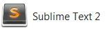
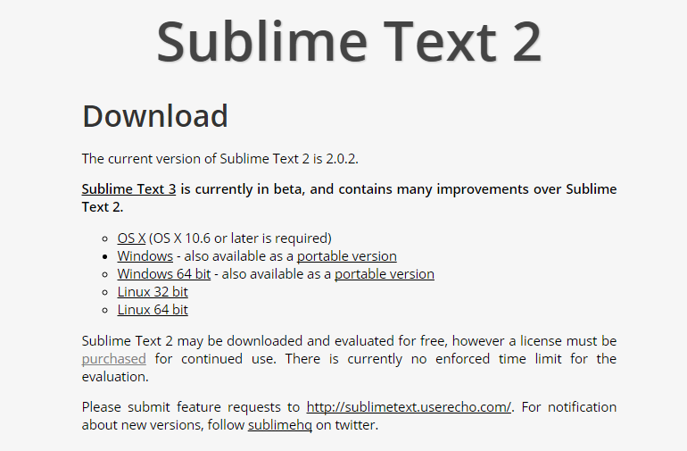

#Setup

##Instructions for working in Walton Building PC Labs:

If you are working on the workstations in the IT Building, choose Sublime Text 2 from the programs menu.

Proceed with the next step of the lab.

##Instructions for working on your own laptop

Download and install Sublime Text 2 from

 - <http://www.sublimetext.com/>

Select the appropriate download for your laptop (OS, Windows, Linux)

