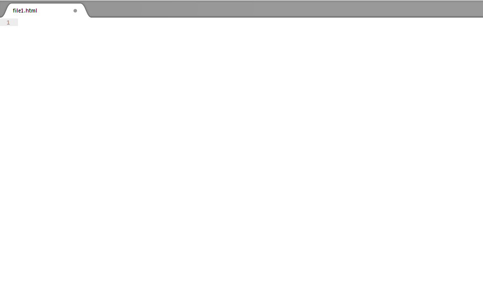

#Tips and Hints

When creating web pages we will use Sublime as the editor tool. It is like notepad but has nicer features.

On the left hand side of the editor you can see the folder you are working in and all the files in that folder, similar to what you see in windows explorer or Mac Finder. 
For example I have created a folder with two files contained in that folder, each of those files is shown indented and below the folder name. For each file you will also see its extension. For example .html

The main editing window in sublime is where you will write code for the webpages.

Once you click on a file it will appear in the editor window, it will show blank if it is empty or you will see the code you have written.

It is important to regularly save your work, this might seem obvious but everyone looses work at some point in the semester and you'd be surprised how many say "I just forgot to save it!"

In sublime if you go to close your files it will prompt you to see if you want to save your work, however better practice is to always save after first creating a new file so that you name it correctly and then as you edit your code you should continually save your work.