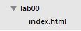

#Introduction Project

You will create a simple web page for it Starbuzz Coffee shop. They have made a name for itself as the fastest growing coffee shop around. If you’ve seen one on your local corner, look across the street—you’ll see another one. In fact, they’ve grown so quickly, they haven’t even managed to put up a web page yet…and therein lies your big break: By chance, while buying your Starbuzz Chai Tea, you run into
the Starbuzz CEO… who asks for your help...

These are the steps you will carry out:

To prepare we will create a folder structure to store our work.

If you are working on a pc in the IT lab, create a new folder on either your G drive or on your usb drive, name the folder WebDevelopment, inside that folder create another folder called Lab00.

First on the list of tasks is to create a html file in our favourite text editor.

Open Sublime and choose Open Folder from the File menu. Navigate to the WebDevelopment folder that you just created and click OK.

In sublime click on the WebDevelopment folder, you should see the La00 folder appear.

You will be creating a new folder for each weekly lab you work on in this semseter.

Chose New File from the File menu, a new blank page should appear in the sublime window. When you open a new file you must tell Sublime what you want to name it. Click Save on the File menu and name the file index.html, save it into the Lab00 folder. You should see the file name appear in the left panel in sublime.

Second on the list of tasks we type in the menu that the CEO provided to us on the napkin.

To do this we click on the index.html file we just created and the blank page appears in sublime. In that page we type the following:

~~~

Starbuzz Coffee Beverages

House Blend, $1.49
A smooth, mild blend of coffees from Mexico, Bolivia and Guatemala.

Mocha Cafe Latte, $2.35
Espresso, steamed mild and chocolate syrup.

Cappuccino, $1.89
A mixture of espresso, steamed milk and foam.

Chai Tea, $1.85
A spicy drink made with black tea, spices, milk and honey.

~~~

Third on the list of tasks is to save the file. Click on the File menu in Sublime and choose Save.

Your file in sublime should look like this:

