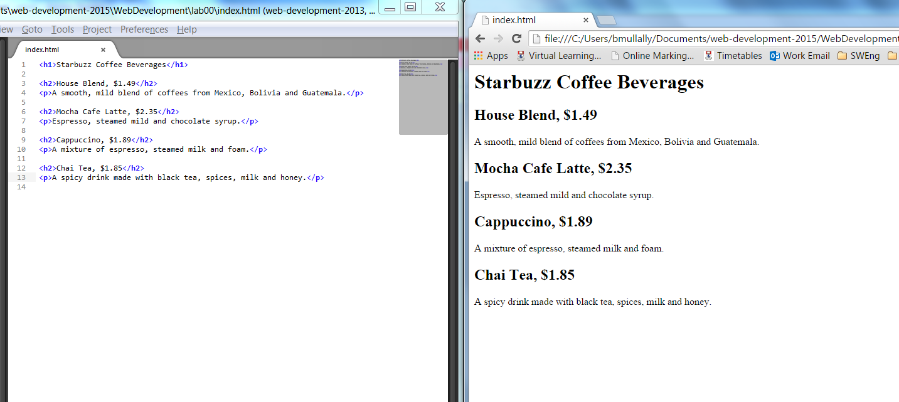

#Web Browser

For this module we will be using Google's Chrome as our chosen Web Browser, it should be on all pc's in the IT building and if you are using your laptop you can download it here

- <http://www.google.com/chrome/>

Open your Chrome web browser, it should be on the desktop or in the programs menu.

To open a file in Chrome you press Ctrl+o , this is the shortcut using the letter 'o' for Open. 
An Open dialog box appears, using this you navigate to your Web Development folder, go to the Lab00 folder and click on the index.html file. Click Open.

Your web page in the Chrome browser should look like this:

Success! you have got the page loaded in the browser, although the results are a little..uh..unsatisfying. But that's just because all you've done so far is go through the mechanics of creating a page and viewing it in the browser. So far you have only typed the content of the web page.

HTML gives you a way to tell the browser about the structure of your page. What's structure? It is a way of marking up your text so that the browser knows what's a heading, what text is a paragraph, what text is a subheading and so on. Once the browser knows a little about the structure, it can display your page in a more meaningful and readable manner.

So let's add some structure:

The tags shown in the image above are used to place structure to the content we typed. So we want to identify which content is a heading, which is a subheading and which is a paragraph.

If we first identify the heading, it is clearly the first line in our content. Starbuzz Coffee Beverages.
Next a subheading could be House Blend, or Mocha Cafe Latte and so on.
Next a paragraph could be A smooth, mild blend of coffees from Mexico, Bolivia and Guatemala.

Using the tags we surround each piece of content with an opening tag \<h1\> and a closing tag \</h1\>

Save your work in Sublime, click on File and Save.

Now lets open/refresh our web page in Chrome.

If you closed Chrome since you viewed your web page then open it again, press Ctrl+o and choose the index.html file again.

If you still have the index.html file open in Chrome then simply press the refresh button on Chrome or press F5 (Windows)

It is nice to be able to see you html code in sublime and see the web browser window at the same time. You can do this by spliting your screen. In Windows while you have the sublime window open press the Windows button and the left hand arrow button on the keyboard. This will move the sublime window to the left hand side of your screen. Now go to the Chrome page and press the Windows button and the right hand arrow button on the keyboard. This will put the Chrome window to the right half of your screen. Something like this:

