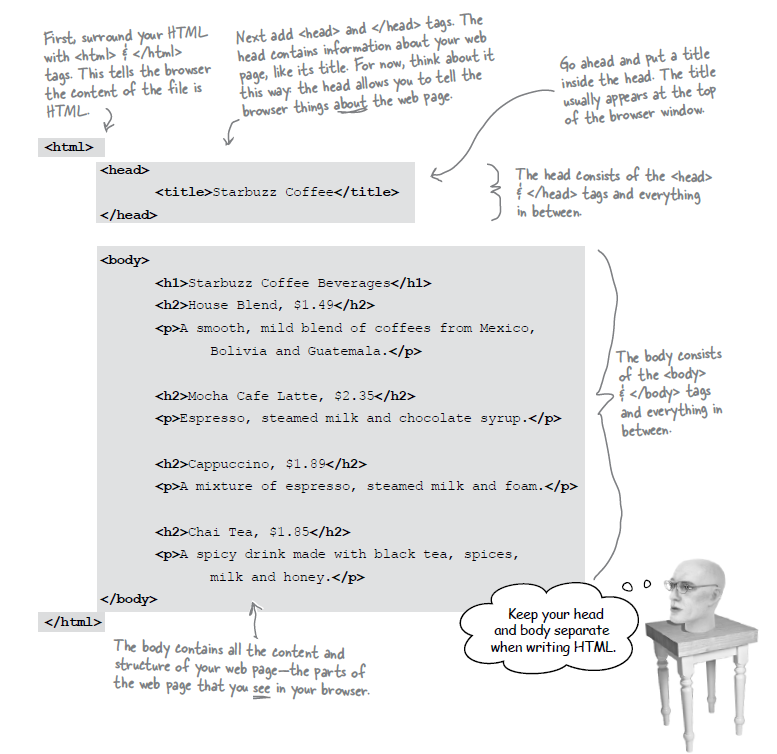
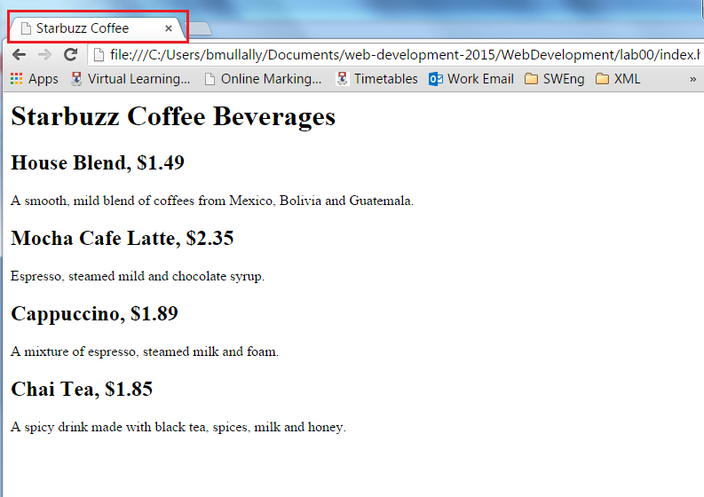

#More HTML

You now have an HTML file with markup - does that make a web page? Almost. 
You will be introduced to the following tags in the lectures
`<html`> `<head`> `<title`>  and `<body`>

For the moment we need to use these tags to make this a proper HTML page...

The content we have included so far should all be contained within the open `<body`> tag and the close `</body`> tag.

We must add a little extra into the `<head`> and `<title`> tags

Save your work in Sublime, click on File and Save.

Your index.html code should look like this:

Now refresh the Chrome browser to see the changes.

You can see the title of the tab in Chrome now says Starbuzz Coffee

Congratulations you have now completed your first web page. 