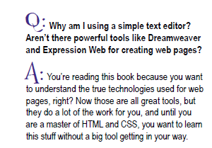
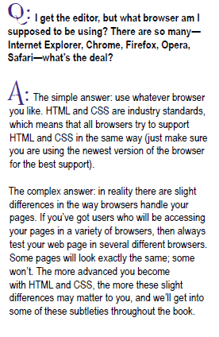

#Queries and Questions

There is a lot to take in and become familiar with while learning web development. You will always have questions, please do ask your tutor, there is never a stupid question. 

For additional support you can use the Internet although there are so many sites the ones we recommend are:

- <https://developer.mozilla.org/en-US/docs/Web/HTML/Reference>

The book we recommend is:

Head First HTML and CSS, 2nd Edition by Elisabeth Freeman & Eric Freeman
published by O'Reilly Media, August 2012.

Print ISBN:978-0-596-15990-0 | ISBN 10:0-596-15990-0
Ebook ISBN:978-1-4493-2448-3 | ISBN 10:1-4493-2448-7

Available to buy on Amazon.co.uk for £24.15

The book is an excellent support for this module, each week the lectures and labs utilise the chapters in the book. We strongly recommend you buying this book.

Some typical questions that you might have after completing this lab are as follows:

If you have any queries please do ask your tutor.

#Exercise 1:

Explore this reference site here:

- <https://developer.mozilla.org/en-US/Web/HTML>

In particular, locate the `<tags`> you have used in this lab in the Element Reference section:

- <https://developer.mozilla.org/en-US/Web/HTML/Element

For examples this is the `<p`> element:

- <https://developer.mozilla.org/en-US/Web/HTML/Element/p>

The text is very technical - but some of it will start to make sense over the next few weeks.

#Exercise 2:

At the end of this page:

- <https://developer.mozilla.org/en-US/Web/HTML/Element/p>

is a See Also section, which suggests two elements:

- `
`
- ` `

Look up these in the reference, and try them out on the page you have designed.