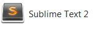

#Setup

##Instructions for working in Walton Building PC Labs:

If you are working on the workstations in the IT Building, choose Sublime Text 2 from the programs menu.

Proceed with the next step of the lab.

##Instructions for working on your own laptop

Download and install Sublime Text 2 from

 - <http://www.sublimetext.com/>

Select the appropriate download for your laptop (OS, Windows, Linux)

This site has some useful tutorial videos in how to use Sublime Text 2. You should at least watch the first 2.

 - <http://code.tutsplus.com/courses/perfect-workflow-in-sublime-text-2

We recommend using Chrome as your web browser.