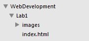
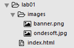

#First Project

If you are working on a pc in the IT lab, open your WebDevelopment folder that you created last week (on your G drive or USB drive), inside that folder create another folder called Lab01.

Open Sublime and choose Open Folder from the File menu. Navigate to the WebDevelopment folder and choose click OK.

In sublime click on the WebDevelopment folder, you should see the Lab1 folder appear.

Chose New File from the File menu, a new blank page should appear in the sublime window. Click Save on the File menu and name the file index.html, save it into the Lab1 folder. You should see the file name appear in the left panel in sublime.

Now in File Explorer create another folder in Lab1 that is called images

Next you are to save the following images into the images folder:

Right click on each one and choose Save As. Make sure you save them into the Images folder.

It is worth making sure your folder structure is the same as this:

The WebDevelopment folder will hold a folder for each lab you work on for this module. For today the Lab1 folder will contain at least one .hmtl file as well as an images folder which in turn contains 6 images.