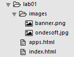
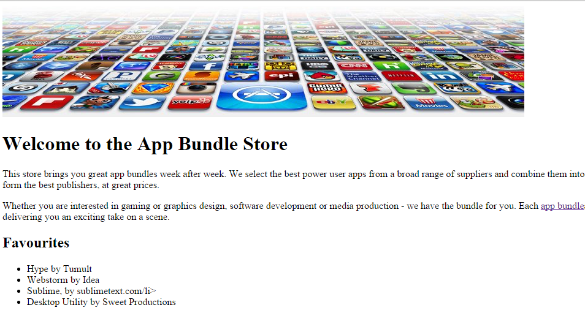

#HTML pages

We are going to create a web site that is based on the Google Play site or the Apple app store. It will present mobile apps, music, and movies to the user.

Choose New File from the File menu, next choose Save from the file menu and name it apps.html
Do the same for a file named movies.html and one called music.html

You should now have the following folder and file structure:

Next you will write some html code. Copy and paste in the following code:

##index.html page content

~~~

<!DOCTYPE HTML>
<html>
  <head>
    <title>Bundle APP Store</title>
  </head>
  <body>
    
    <h1>Welcome to the App Bundle Store</h1>
    

      This store brings you great app bundles week after week. We select the best power 
      user apps from a broad range of suppliers and combine them into great deals. These are the highest quality apps form the best publishers, at great prices.  
    

    

      Whether you are interested in gaming or graphics design, software development or media production - we have the bundle for you. Each <a href="apps.html">app bundle</a> is designed to compliment the others, delivering you an exciting take on a scene.  
    

       <h2>Favourites</h2>
    <ul>
      <li>Hype by Tumult</li>
      <li>Webstorm by Idea</li>
      <li>Sublime, by sublimetext.com</li>
      <li>Desktop Utility by Sweet Productions</li>
    </ul>
  </body>
</html>

~~~

##apps.html page content

~~~

<!DOCTYPE HTML>
<html>
  <head>
    <title>Bundle APP Store</title>
  </head>
  <body>
    <h1>Score</h1>
      <h3>Freebie</h3>
     

       Stacksocial just published its so called Free Ondesoft Mac Tool Bundle, which contains 5 apps from Ondesoft. The bundle worth $146 will be probably available only a couple of days so you’d better hurry up to get it.
     

     

       
     

     

     

     <h3>Macware Business Bundle</h3>
     

       Here comes the next bundle for march. This time its macware who publish a bundle. The so called macware Business Bundle contains 6 apps at a price of only $29.99 instead of $199.94. So you can save around 84%. There is n...
     

  </body>
</html>

~~~

Remember to save your files in sublime by clicking File -> Save All

Test these pages out by opening the index.html in your browser window. Do all of the images display? Does the link to the apps.html page work?

