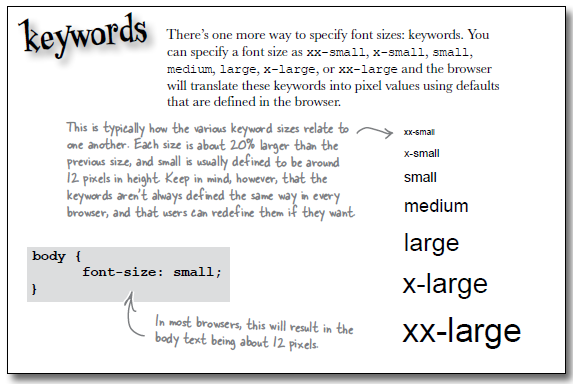

#Fonts

###Font families

Each font family contains a set of fonts that share common characteristics. There are five font familys: sans-serif, serif, monospace, cursive, and fantasy. Each family includes a large set of fonts. Fonts are not consistently available from one computer to another. The available fonts depends on the operating system as well as the fonts and applications that a user has installed. Here's a an example of how to use font-family:

~~~css
body
{
  font-family: Verdana, Helvetica, Arial, sans-serif;
}
~~~

The font-family property provides you with a list of preferred fonts. The idea is that most browsers will have your first choice, in this case Verdana, but if none of the specific fonts can be found then the browser uses its default "sans-serif" font. Always put a generic font family name at the end, like "serif" or "sans-serif". Experiment with these in the style.css

##Font sizes

Often the default sizes for headings are a bit large to change these defaults, we have four general techniques:

##1. Specifying using pixels.

You can specify a font size in pixels. When you specify font size in pixels, you are telling the browser how many pixels tall the letters should be.

~~~css
body
{
font-size: 14px;
}
~~~

The px must come directly after the number, there cannot be a space between them.

##2. Specifying using percentage.

Unlike pixels, which tell the font exactly how big it should be in pixels, a font size specified as a percentage tells the font how big it should be relative to another font size.

~~~css
h1
{
  font-size: 150%;
}
~~~

This says that the font size should be 150% of another font size. Font-size is a property that is inherited from the parent element, when you specify a % font size it is relative to the parent element. `<h1>` inherits from body so `<h1>` headings will be 150% of 14px.

##3. Specifying using "em".

This like percentage is another unit of measure. With em you don't specify a percentage, instead you specify a scaling factor.

~~~css
h2
{
  font-size: 1.2em;
}
~~~

If you use this to specify a `<h2>` heading your `<h2>` headings will be 1.2 times the font size of the parent element, which in this case is 1.2 times 14px, which is about 17px.

##4. Specifying using keywords.

You can specify a font size as xx-small, x-small,small,medium, large, x-large, or xx-large and the browser will translate these keywords into pixel values using defaults that are set in the browser.

~~~css
body
{
  font-size: small;
}
~~~

It is important to note that earlier version of Internet Explorer does not support text scaling when the font size is specified using pixels.  Change the font sizes on web pages. Add in the relevant properties to your existing rules:

~~~css
body
{
  font-size: small;
}
h1
{
  font-size: 150%;
}
h2
{
  font-size: 130%;
}
~~~

Save your css file and reload the home page. Take a look at the change in sizes.

##Font Weight

The font weight property allows you to control how bold the text looks. Bold text looks darker than normal text and tends to be a bit fatter too. You can make any element use bold text by setting the font-weight property to bold.

~~~css
p
{
  font-weight: bold;
}
~~~

You can also do it the other way, if you have an element that is set to bold by default, or is inheriting bold from a parent, then you can remove the bold.

~~~css
h1
{
  font-weight: normal;
}
~~~

Experiment with changing the headings for the web site so that the bold is changed to normal weight. Add the rule to your CSS file and reload the web site. Once you have seen the difference in the headings, change it back to bold.
