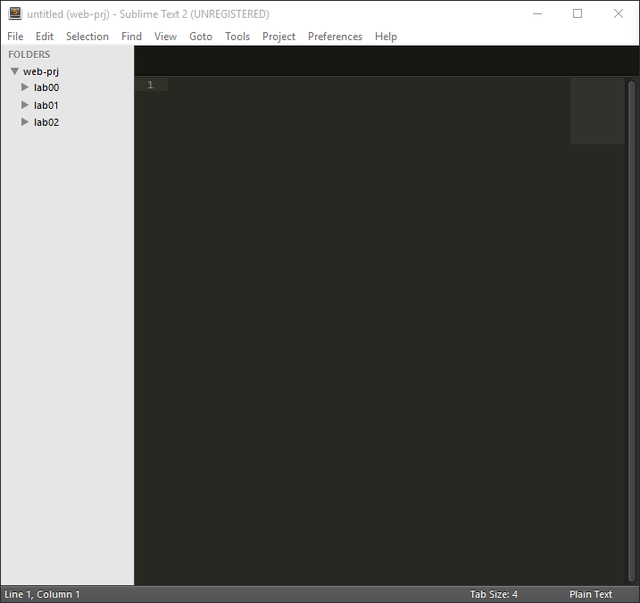
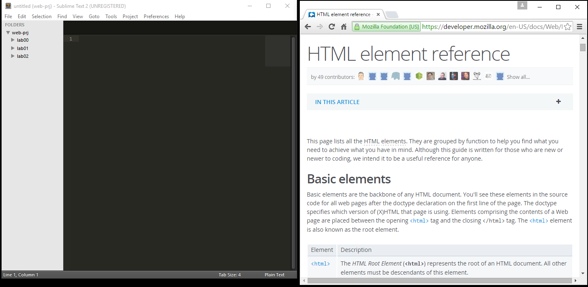
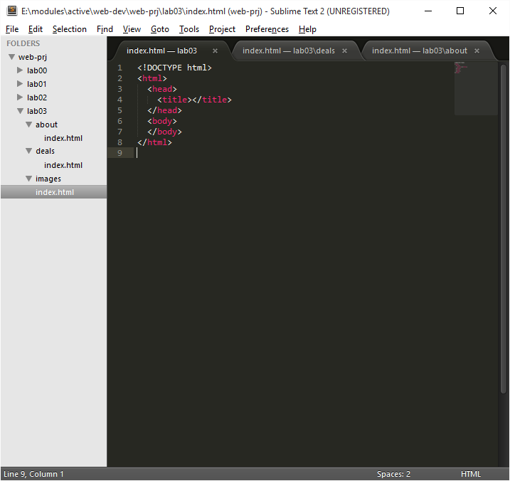
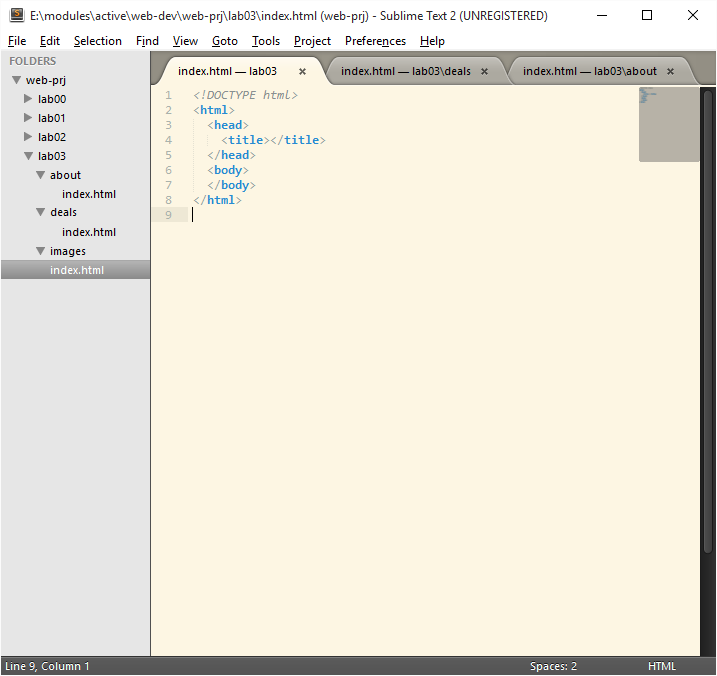

#Setup

This week we wil start a new project, but we will NOT copy over any material from last week - but rather start with a blank slate.

Open Sublime text editor - and open the `directory` containing your web development projects (this folder is called `web-prj` below):

If you have room, also open the Chrome web browser side by side:

In the above, we are keeping a tab of the browser open at

- <https://developer.mozilla.org/en-US/docs/Web/HTML/Element>

The Mozilla foundation are an excellent source of reference information on all things web - and it is useful to keep the html reference site open to occasionally check that your are using the correct structure for your elements.

Create a new folder in your project called `lab03` 

(Right click on `web-prj` to create the folder)

Now we can create the project structure:

That is, we have created these folders inside the project:

- about
- deals
- images

Here is a blank html file:

~~~
<!DOCTYPE html>
<html>
  <head>
    <title></title>
  </head>
  <body>
  </body>
</html>
~~~

Create a file called 'index.html' in the following locations:

lab03
 - index.html
 - about/index.html
 - deals/index.html

Should see something like this:

You can see all the files are open in tabs across the top.

There are alternative colour schemes - for instance 'Solarised Light':

These are available via the `Preferences` menu.