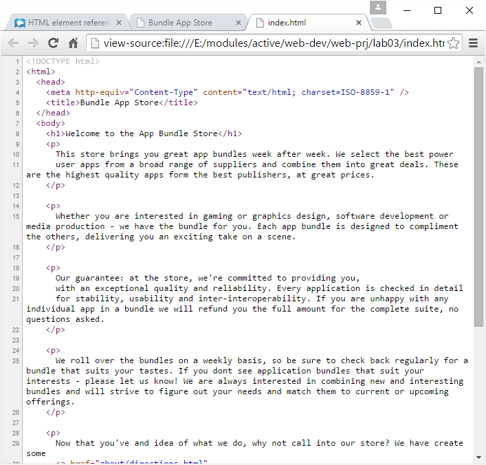
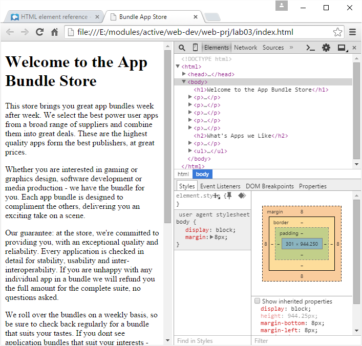
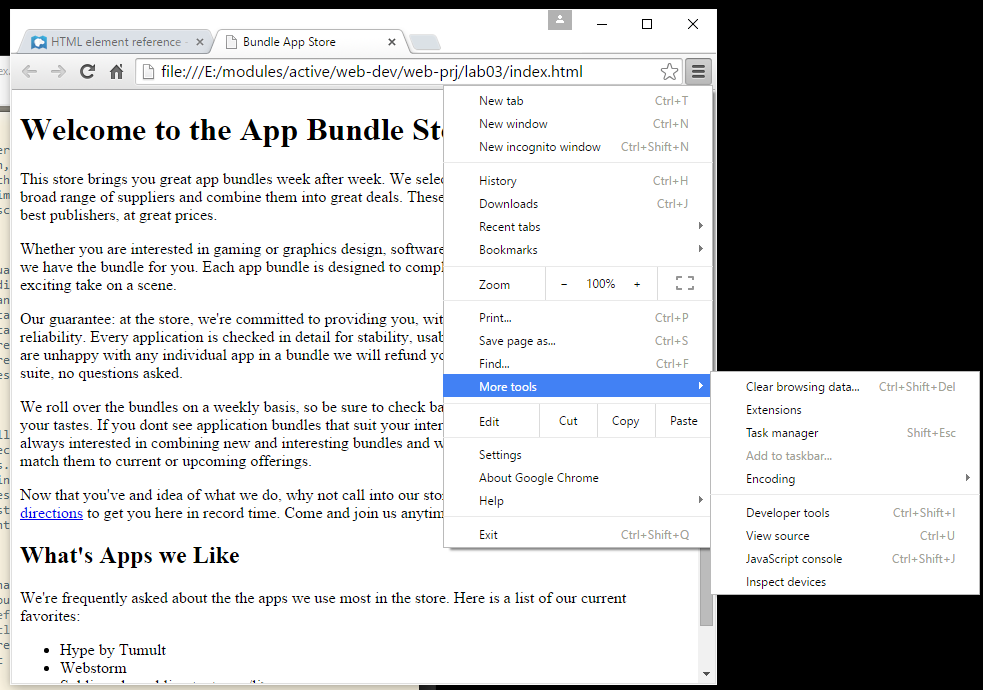

#Main page

##lab03/index.html

Open the main index.html page and replace the template contents with the following:

~~~
<!DOCTYPE html>
<html>
  <head>
    <meta http-equiv="Content-Type" content="text/html; charset=ISO-8859-1" />
    <title>Bundle App Store</title>
  </head>
  <body>
    <h1>Welcome to the App Bundle Store</h1>
    

      This store brings you great app bundles week after week. We select the best power 
      user apps from a broad range of suppliers and combine them into great deals. These are 
      the highest quality apps form the best publishers, at great prices.  
    

    

      Whether you are interested in gaming or graphics design, software development or media 
      production - we have the bundle for you. Each app bundle is designed to compliment the 
      others, delivering you an exciting take on a scene.  
    

    

        Our guarantee: at the store, we're committed to providing you, 
        with an exceptional quality and reliability. Every application is checked in detail
        for stability, usability and inter-interoperability. If you are unhappy with any 
        individual app in a bundle we will refund you the full amount for the complete suite, 
        no questions asked.
    

    

      We roll over the bundles on a weekly basis, so be sure to check back regularly for 
      bundle that suits your tastes. If you dont see application bundles that suit your 
      interests - please let us know! We are always interested in combining new and 
      interesting bundles and will strive to figure out your needs and match them to current 
      or upcoming offerings.
    

    

      Now that you've and idea of what we do, why not call into our store? We have create 
      some  
      <a href="about/index.html"
         title="Detailed Directions to the Store">detailed directions</a>   
      to get you here in record time. Come and join us anytime.
    

    <h2>What's Apps we Like</h2>

    

      We're frequently asked about the the apps we use most in the store. Here is a list of 
      our current favorites:
    

    <ul>
      <li>Hype by Tumult</li>
      <li>Webstorm by Idea</li>
      <li>Sublime, by sublimetext.com/li>
      <li>Desktop Utility by Sweet Productions</li>
    </ul>
    

      2015, Bundle App Store  
      All trademarks and registered trademarks appearing on this site are 
      the property of their respective owners.
    

  </body>
</html>
~~~

... and open this same file in the browser:

Check the 'Directions' link and make sure it works. Introduce the following content for the file `about/index.html`:

~~~
<!DOCTYPE html>
<html>
  <head>
    <meta http-equiv="Content-Type" content="text/html; charset=ISO-8859-1" />
    <title>Bundle Store Directions</title>
  </head>
  <body>
    <h1>Directions</h1>
    
Take the 305 S exit to Webville - go 0.4 mi

    
Continue on 305 - go 12 mi

    
Turn right at Structure Ave N - go 0.6 mi

    
Turn right and head toward Structure Ave N - go 0.0 mi

    
Turn right at Structure Ave N - go 0.7 mi

    
Continue on Stucture Ave S - go 0.2 mi

    
Turn right at SW Presentation Way - go 0.0 mi

    

      <a href="../index.html">Back to the Store</a>
    

  </body>
</html>
~~~

Any change you make in the sublime will only appear in the browser if you:

- save the changes in sublime
- refresh the page in chrome.

Make sure both pages render in chrome as expected.

Additionally, chrome has some interesting features to let you explore the page 'source'. The simplest one is to just right click anywhere in the browsers and select `View Source`:

A more sophisticated option is to use `Developer Tools`:

To reproduce the above, first close the `source` view we just opened above, and proceed to access the tools as shown here:

Explore the developer tools for a little while - notice how the `box model` seems to be visible. Then close it, we will return to it later.

