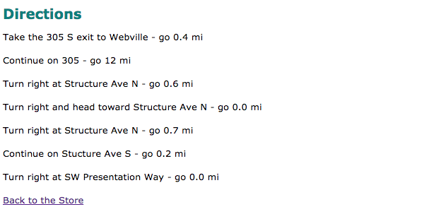

#Style Sheet

Our first step will be to include a style sheet. Create a file called 'store.css' and include the following:

~~~
body {
  font: small/1.6em Verdana, Helvetica, Arial, sans-serif;
}

h1, h2 {
  color: #007e7e;
}

h1 {
  font-size: 150%;
}

h2 {
  font-size:130%;
}
~~~

Now edit the main index.html file, and link the stylesheet by inserting this into the `<head>` element:

~~~
    <link type="text/css" rel="stylesheet" href="store.css" media="screen" />
~~~

Make sure you save everything, and then refresh chrome. It should render a new style - something like this:

Do you notice that the directions page still seems to use the default fonts? This is because it is not linked to the stylesheet. Incorporate this now by this entry in the `<head>` element:

~~~
    <link type="text/css" rel="stylesheet" href="../store.css" media="screen" />
~~~

Verify that it now renders as expected:

Note carefully how the link slightly different to the previous one. Why is that?
