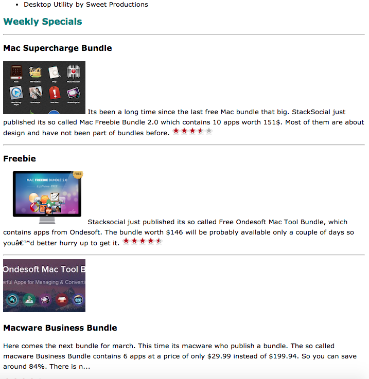
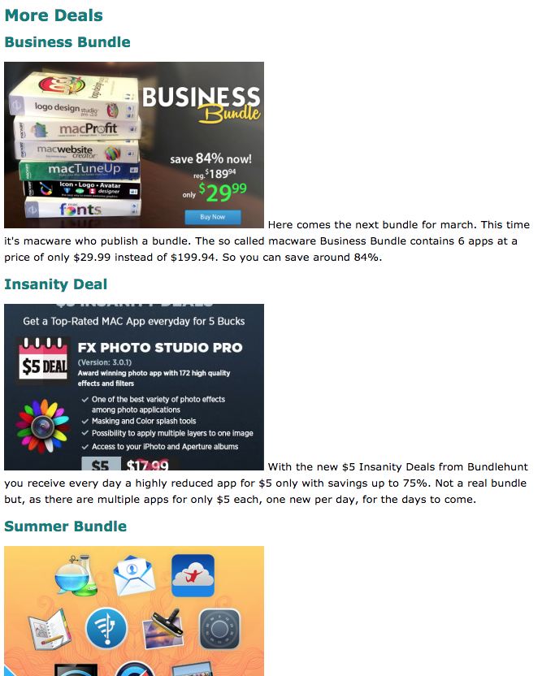

#Additional Content

Here is some additional content for the main index.page:

~~~
    <h2>Weekly Specials</h2>
    

    <h3>Mac Supercharge Bundle</h3>
    

      
      Its been a long time since the last free Mac bundle that big. StackSocial just 
      published its so called Mac Freebie Bundle 2.0 which contains 10 apps worth 151$.
      Most of them are  about design and have not been part of bundles before.
      
    

    

    <h3>Freebie</h3>
    

       
       Stacksocial just published its so called Free Ondesoft Mac Tool Bundle, which contains 
       apps from Ondesoft. The bundle worth $146 will be probably available only a couple of 
       days so you’d better hurry up to get it.
       
    

    

    <h3>Macware Business Bundle</h3>
    

      
       Here comes the next bundle for march. This time its macware who publish a bundle. The 
       so called macware Business Bundle contains 6 apps at a price of only $29.99 instead of 
       $199.94. So you can save around 84%. There is n...
      
    

    

    

       See some other great deals <a href="deals/index.html" title="Deals">here</a>.
    

~~~

Place this content directly into the page, just before the closing `</body>` tag. It should look like this:

Note that the images we have set up don't seem to work - and are represented in chrome as broken image links.

We can fix this now. Here is a zipped archive of all the images we will need:

- [images.zip](archives/images.zip)

Download and expand this file - move/copy all the image files into a new `images` folder in your project. If all goes well, the a refresh of the browser should bring this:

Lets now bring in the `deals/index.html' content:

~~~
<!DOCTYPE html>
<html>
  <head>
    <meta http-equiv="Content-Type" content="text/html; charset=ISO-8859-1" />
    <title>App Bundle Deals</title>
    <link type="text/css" rel="stylesheet" href="../store.css" />
  </head>
  <body>
    <h1>More Deals</h1>

    <h2>Business Bundle</h2>
    

      
        Here comes the next bundle for march. This time it's macware who publish a bundle. The so called macware Business Bundle contains 6 apps at a price of only $29.99 instead of $199.94. So you can save around 84%.
    

    <h2>Insanity Deal</h2>
    

      
        With the new $5 Insanity Deals from Bundlehunt you receive every day a highly reduced app for $5 only with savings up to 75%. Not a real bundle but, as there are multiple apps for only $5 each, one new per day, for the days to come.
    

    <h2>Summer Bundle</h2>
    

      
      The new bundle from StackCommerce contains quite a few apps which have never been in bundles before. The so called Summer Mac Essentials Bundle comes with 10 apps for only $19.99. That is 91% off the original price of $234!
    

    

      <a href="../index.html">Back to the Store</a>
    

  </body>
</html>
~~~

This should render correctly first time, as we have the images already in place:

Look carefully at the paths to the images in the html source.

Make sure you can navigate to all three pages now:

- index.html
- about/index.html
- deals/index.html

(the link to 'deals' is at the very end of the main page)
