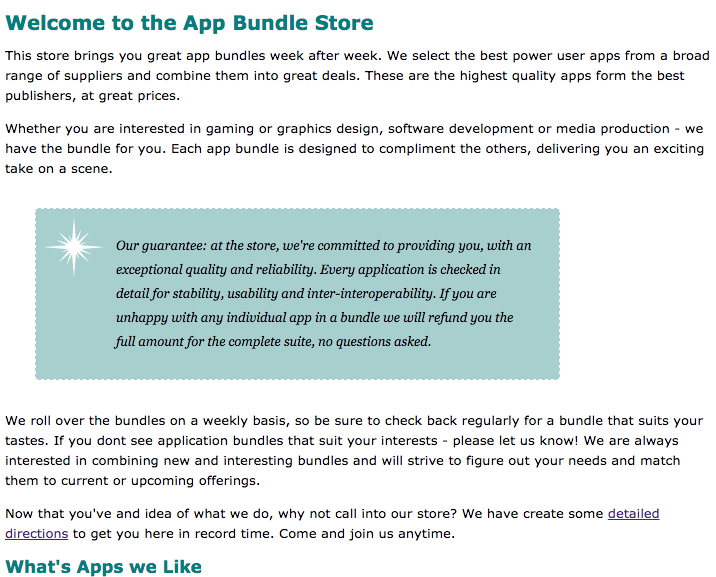

#Guarantee Paragraph

Locate the 'guarantee' paragraph in the home page (the third paragraph):

~~~html
    

      Our guarantee: at the store, we're committed to 
      providing you, with an exceptional quality and reliability. 
      Every application is checked in detail for stability, usability 
      and inter-interoperability. If you are unhappy with any individual app 
      in a bundle we will refund you the full amount for the complete 
      suite, no questions asked.
    

~~~

(begins around line 19)

We would like to target this specific paragraph with some custom styles. To this end, we nominate it to a 'class' called 'guarantee':

~~~html
  

      Our guarantee: at the store, we're committed to 
      providing you, with an exceptional quality and reliability. 
      Every application is checked in detail for stability, usability 
      and inter-interoperability. If you are unhappy with any individual app 
      in a bundle we will refund you the full amount for the complete 
      suite, no questions asked.
  

~~~

In our stylesheet, we can devise a rule just for this paragraph:

~~~css
.guarantee
{
  border-color: black;
  border-width: 1px;
  border-style: solid;
  background-color: #a7cece;
}
~~~

Reload and review how the paragraph looks:

We can see evidence of our targeted styles.

We can add a little margin:

~~~css
.guarantee
{
  /* as before */
  margin: 30px;
}
~~~

Note that `/* as before */` above means leave the existing properties in place and just add the `margin` to the end of the `'guarantee` rule.

Reload the page:

Next, the background image. Save this image here to your images folder:

...and we can extend the `guaranteee` rule with this property here:

~~~css
  background-image: url(images/background.gif) ;
~~~

This seems to yield a repeated pattern:

Some further refinements to the same rule can put a single image in the top right:

~~~css
  background-repeat: no-repeat;
  background-position: top-left;
~~~

Reloading again:

And we can also further refine the padding:

~~~css
  padding: 25px;
  padding-left: 80px;
  margin-right: 150px;
~~~

Looks like this:

Our full rule for guarantee now looks like this:

~~~css
.guarantee
{
  border-color: black;
  border-width: 1px;
  border-style: solid;
  background-color: #a7cece;

  margin: 30px;
  padding: 25px;
  padding-left: 80px;
  margin-right: 150px;

  background-image: url(./images/background.gif);

  background-repeat: no-repeat;
  background-position: top-left;
}
~~~

Some further adjustments to the text itself:

~~~css
  line-height: 1.9em;
  font-style: italic;
  font-family: Georgia, "Times New Roman", Times, serif;
  color: black;
~~~

Finally, we might adjust the border pattern:

~~~css
  border-color: white;
  border-width: 1px;
  border-style: dashed;
~~~

Which turns out as:

Regrouping the properties, this is the complete rule:

~~~css
.guarantee
{
  border-color: white;
  border-width: 1px;
  border-style: dashed;

  margin: 30px;
  padding: 25px;
  padding-left: 80px;
  margin-right: 150px;

  background-color: #a7cece;
  background-image: url(./images/background.gif);
  background-repeat: no-repeat;
  background-position: top-left;

  line-height: 1.9em;
  font-style: italic;
  font-family: Georgia, "Times New Roman", Times, serif;
  color: black;
}
~~~
