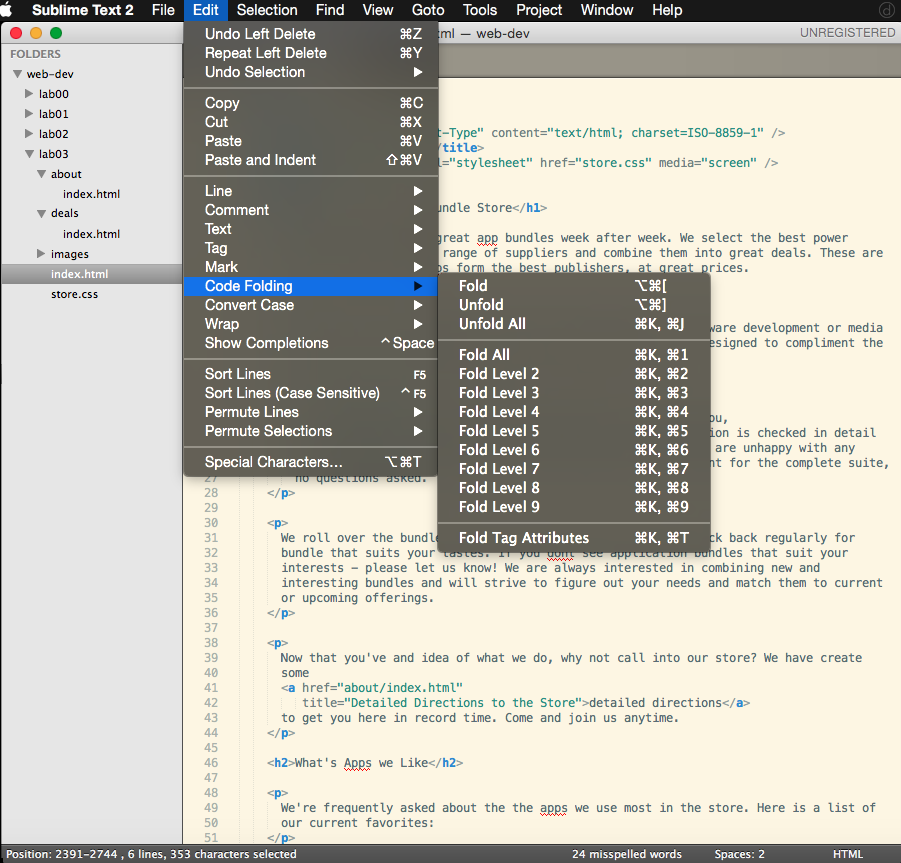
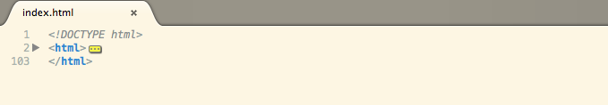

#Folding View in Sublime

Your editor may look like this currently:

Now select the following menu option - `Edit->Code Folding->Fold All`:

This 'folds' the editor, showing you just the highest level elements. 

Using the small arrows in the margin, you should be able to reveal/expand elements at different levels in the document:

See if you can match approximately the following views:

This can be challenging to effect - as the arrow will only appear when you hover in the correct column in the margin:
