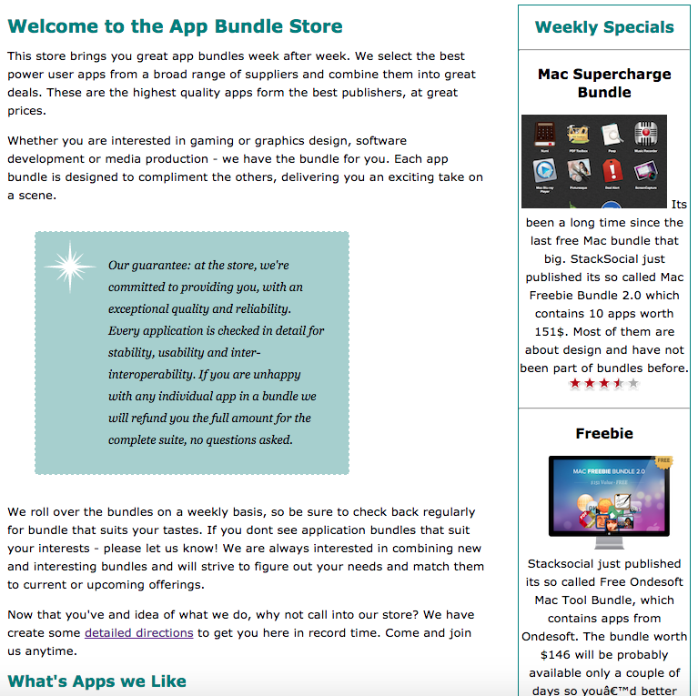

#Floating Sections

The `
s` we have introduced have had no effect on the visual appearance of the main page - it should still look exactly as it did before we incorporated them:

We can now target this division directly with the following new rules in CSS:

~~~css
#weeklyspecials {
  border-width: thin;
  border-style: solid;
  border-color: #007e7e;

  width: 25%;
  padding: 0px 20px 30px 10px
  margin-left: 20px;

  text-align: center;

  float:right;
}

#maincontent {
  float:left;
  width:70%;
}
~~~

Copy/paste this into your css file and refresh the page:

This is the final version of our store.css:

~~~
body {
  font: small/1.6em Verdana, Helvetica, Arial, sans-serif;
}

h1, h2 {
  color: #007e7e;
}

h1 {
  font-size: 150%;
}

h2 {
  font-size:130%;
}

.guarantee {
  border-color: white;
  border-width: 1px;
  border-style: dashed;

  margin: 30px;
  padding: 25px;
  padding-left: 80px;
  margin-right: 150px;

  background-color: #a7cece;
  background-image: url(./images/background.gif);
  background-repeat: no-repeat;
  background-position: top-left;

  line-height: 1.9em;
  font-style: italic;
  font-family: Georgia, "Times New Roman", Times, serif;
  color: black;
}

#weeklyspecials {
  border-width: thin;
  border-style: solid;
  border-color: #007e7e;

  width: 25%;
  padding: 0px 20px 30px 10px
  margin-left: 20px;

  text-align: center;

  float:right;
}

#maincontent {
  float:left;
  width:70%;
}
~~~

