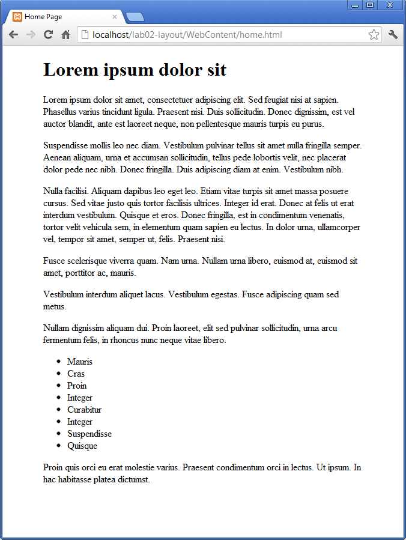

#Body style

We already have an empty style sheet in place. However, it is not yet linked to our home page.

Insert the following into the `<head`> element of the home.html to tie in the stylesheet:

~~~html
    <link type="text/css" rel="stylesheet" href="home.css" media="screen" />
~~~

Now lets try the following simple rule:

~~~css
body
{
  width: 80%;  
  margin: 0 auto;
}
~~~

Save, and refresh. The home page should now look like this:

Remember the shortcut rules for CSS. The rule we have introduced is in fact a shorthand for :

~~~css
{
  width: 80%;  
  margin-top: 0;
  margin-bottom: 0;
  margin-left: auto;
  margin-right: auto;
}
~~~

Rules can be 'commented out' if you want them to be temporarily removed. Figure out the notation for commenting in CSS, and verify this by commenting out your existing rule, and replacing with this one.

Additionally, discover the equivalent notations for html (quite different).

This rule is stating that we want no top/bottom for the page, however auto for left and right is resizing the margins to be proportional to the container width (the browser window), and equal in size.

The overall effect is a pleasing border on either size of the page, of equal size.
