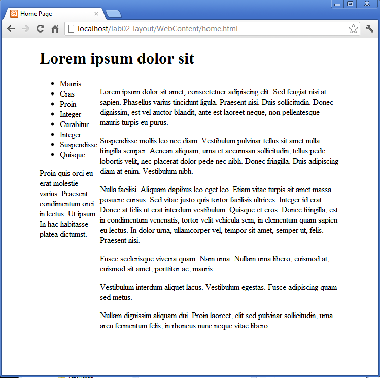
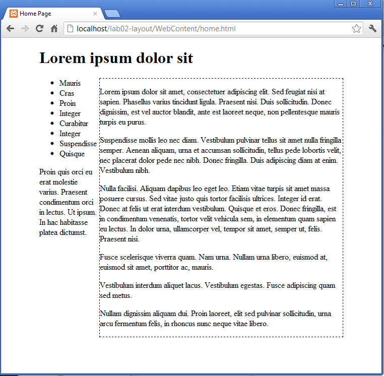

#Maincontent

We will now attempt to "float" the "maincontent" section to the right, with the "navigation" section hopefully moving in to the left.

Try the following rule:

~~~css
#maincontent
{  
  float: right;  
}
~~~

and inspect the results. There should be no change yet. This is because the maincontent section is wide enough to include the full space available. We can adjust this so that is consumes say 80% of the space:

~~~css
#maincontent
{  
  width: 80%;
  float: right;  
}
~~~

We are now starting to see the beginnings of a multicolumn layout:

To get our bearings a bit better, lets introduce a border around the maincontent:

~~~css
#maincontent
{  
  width: 80%;
  float: right;  
  border: dashed thin;
}
~~~

-

As you can see, the "navigation" and "footer" sections have moved up to the left, slipping inside the maincontent. This is because these sections are current obeying the default layout rules. In effect, they will be automatically resizing the fit the available space liberated by the 20% space of the `<body`> that maincontent has liberated.
