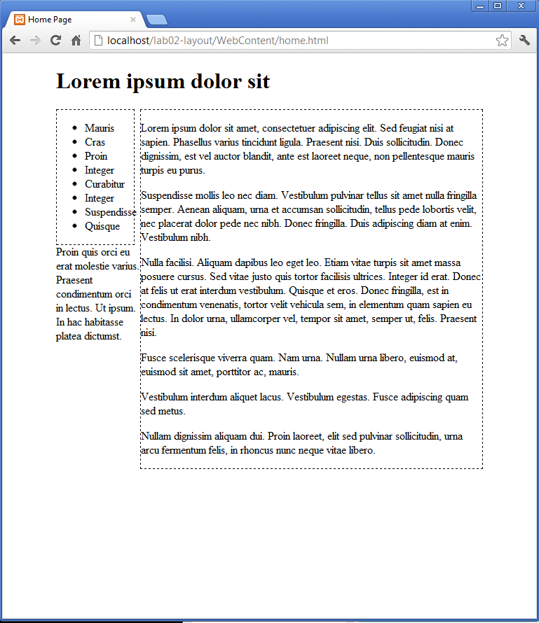

#Navigation

We can introduce a rule to definitively tie the navigation to 20% of the parent size. and float it left (also turning on a border so we can visualize it easier)

~~~css
#navigation
{  
  width: 20%;
  float: left;  
  border: dashed thin;
}
~~~

This produces some alarming results:

The width refers to the content, not padding and margins, so our true width exceeds the available space, so our navigation has been push below where we intended.

We can easily fix this with a little adjustment:

~~~css
#navigation
{  
  width: 18%;
  float: left;  
  border: dashed thin;
}
~~~

Experiment with other percentages to get a feel for the layout behaviour
