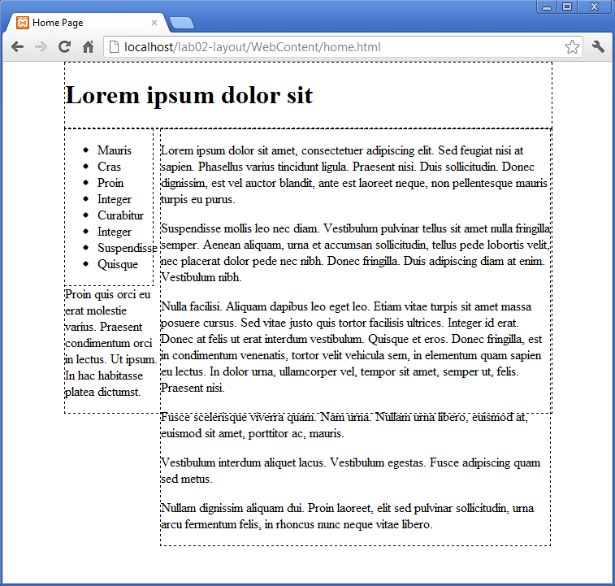

#Header, footer

We can now target the headder and footer, and move them into place.

First the header:

~~~css
#header
{  
  width: 100%;
  border: dashed thin;
}
~~~

This should not have any effect, as the header, being positioned first, is already in place.

Now try the footer:

~~~css
#footer
{  
  width: 100%;
  border: dashed thin;
}
~~~

Save and refresh:

Still not quite right.

We would like to push the footer "clear" of any existing floated elements, and then for it to occupy the denoted size in that zone. This is accomplished with the "clear" property:

~~~css
#footer
{  
  width: 100%;
  clear: both;
  border: dashed thin;
}
~~~

Setting clear to "both", means clear (move below) and blocks floated left or right.

Refresh produces a pleasing result:

