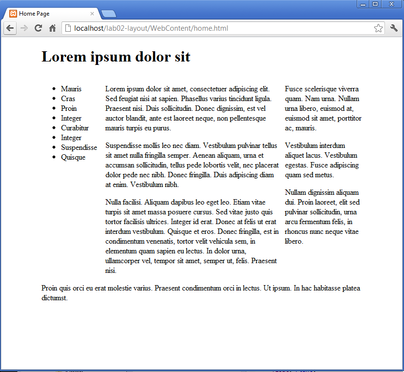

#Primary, secondary

We can also further subdivide sections within existing sections. The "maincontent" section currently contains 6 paragraphs:

Using nesting, we can divide these into two sections:

If we fold this carefully, we can see the following structure:

As yet, this has no bearing on the display. However, two simple rules targeting these sections will layout these sections in two columns:

~~~css
#primary
{  
  width: 68%;  
  float: left;  
}

#secondary
{  
  width: 30%;  
  float: right;
}
~~~

It should render as follows:

If we comment out our wildcard rule:

~~~css
*
{
  //border: dashed thin;
}
~~~

This is the final result:

