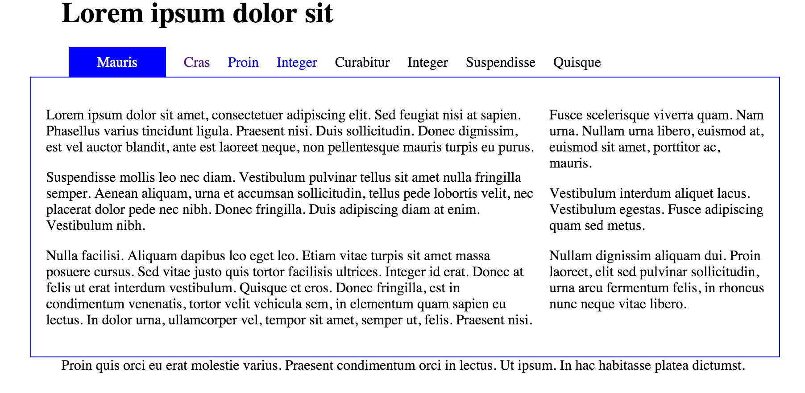

#Navigation

On a web page the navigation can be thought of as the table of contents. You expect the table of contents to direct you to the content you want to access.

In this lab we will create a tabbed navigation section that will look like this:

In HTML the element that best suits a table of contents is the `<ul`> element - which are already using. We will use the ordered list to construct the navigation section of the web page.

Here's the code we have already in our web page:

~~~
    
  
      <ul>  
        <li><a href="home.html">Mauris</a></li>  
        <li><a href="page1.html"> Cras </a></li>  
        <li><a href="page2.html">Proin</a></li>  
        <li><a href="page3.html">Integer</a></li>  
        <li>Curabitur</li>  
        <li>Integer</li>  
        <li>Suspendisse</li>  
        <li>Quisque</li>  
      </ul>  
    

~~~

What we have is an item for each link to a page.

Next we want to ensure our navigation tells the user which page they are currently viewing. We do this by added a class attribute to the appropriate list item. So if we edit the home.html page first we want to add the class attribute "current" to the first list item (Mauris) as below:

~~~
    
  
      <ul>  
        <li class="current"> <a href="home.html">Mauris</a></li>  
        <li><a href="page1.html"> Cras </a></li>  
        <li><a href="page2.html">Proin</a></li>  
        <li><a href="page3.html">Integer</a></li>  
        <li>Curabitur</li>  
        <li>Integer</li>  
        <li>Suspendisse</li>  
        <li>Quisque</li>  
      </ul>  
    

~~~

We must also do this for page1, 2 and 3. So for page1.html add the class attribute "current" to the second list item (Cras). For page2.html add it to the third list item (Proin) and for page3.html add it to the fourth list item (Integer)

When viewing out web pages this makes no visible difference as all we are doing is identifying those elements we will no go on to style in a particular way.

