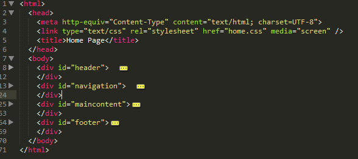
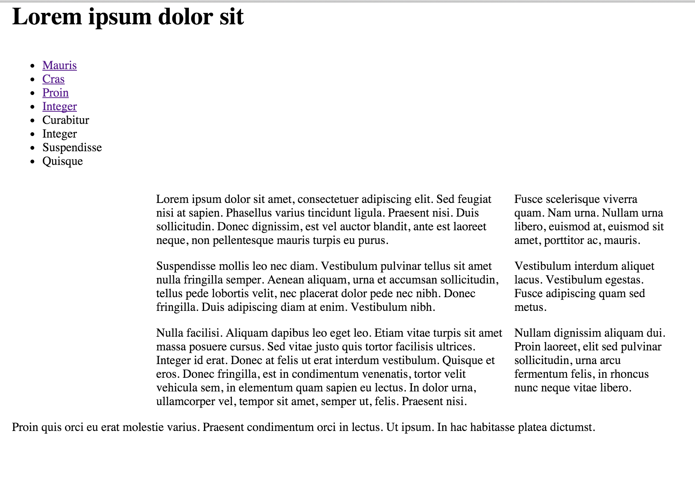
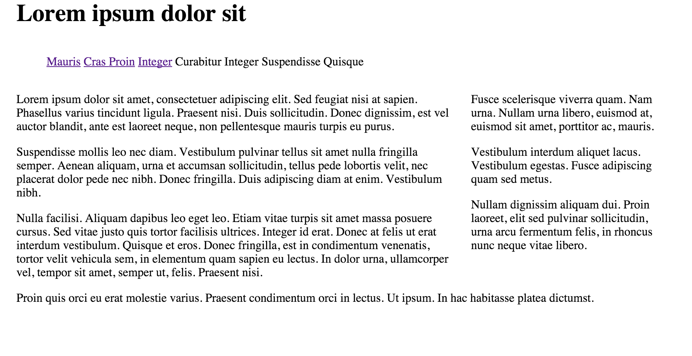

#Forming the Tab

Make sure the 'navigation' division is located towards the top of the page structure between the header and the maincontent. (If you copied the output of last weeks lab, it will be near the end) If we were to take a view of any of the pages using the folding feature if eclipse, we would like to see this:

There are several methods for creating nice navigation on your site, the method we teach in this lab is a pure CSS method using different background colour for 'tabs' on the navigation menu.

Before you go any further make sure your site is 'navigable' without any broken links.

Next we are going to mark each of `<ul>` elements with a new id `menu`:

~~~
    
  
      <ul id="menu">  
        <li class="current"><a href="home.html">Mauris</a></li>  
        <li><a href="page1.html"> Cras </a></li>  
        <li><a href="page2.html">Proin</a></li>  
        <li><a href="page3.html">Integer</a></li>  
        <li>Curabitur</li>  
        <li>Integer</li>  
        <li>Suspendisse</li>  
        <li>Quisque</li>  
      </ul>  
    

~~~

Do this now for all pages - as the `navigation` section appears everywhere.

Again, before you go any further make sure your site is 'navigable' without any broken links. There should be no change in the appearence as yet.

In your css flle, change the `navigation` rule to make that section the full width:

~~~
#navigation
{  
  width: 100%;
  float: left;  
}
~~~

This will have the effect of making the navigation section pop up to the top of the page:

In yoiur css file, introduce this rule at the very end:

~~~
ul#menu li 
{
  display:inline; 
}
~~~

This is make the navigation section now appear all on one line:

Refresh the page - can you see a difference? If you cant, delete the rule and refresh again until you can see the small change.

One last change for this step - change `maincontent` to be the full width of the page:

~~~
#maincontent
{  
  width: 100%;  
  float: right;
}
~~~

