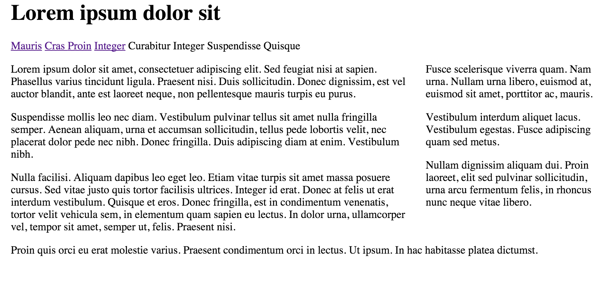
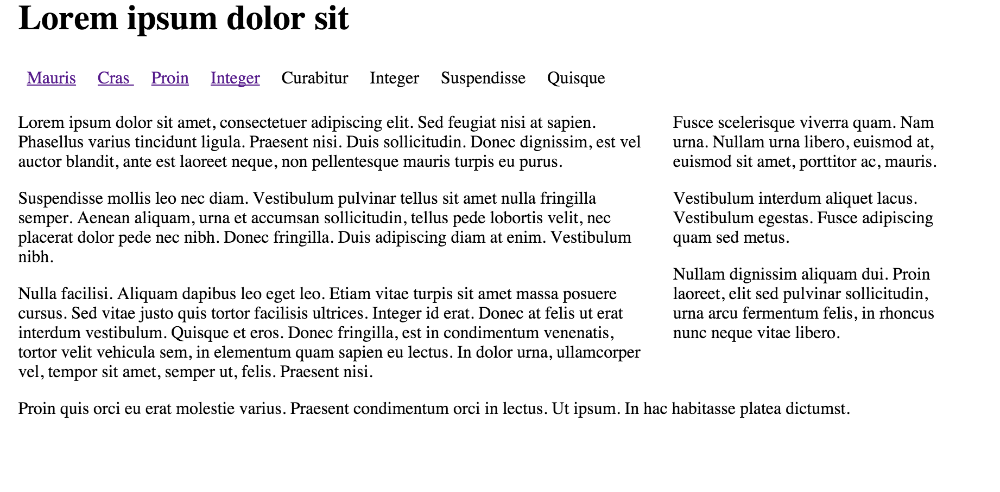
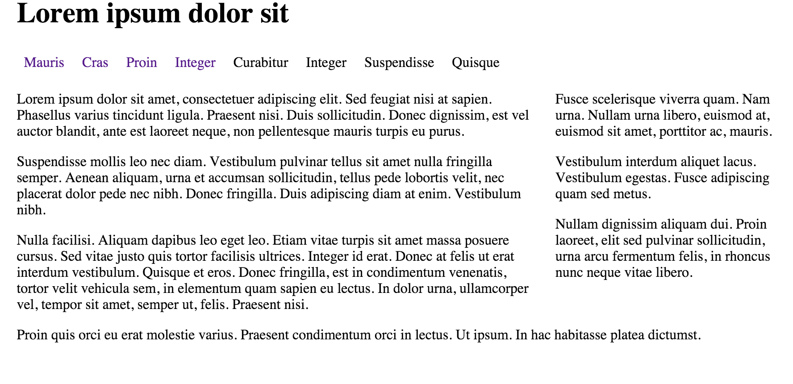

#Establishing the Tab Bar

Next add the following rule to the home.css file:

~~~
ul#menu 
{
  margin: 0;
  padding: 0;
}
~~~

This has the effect of tightening the navigation section - and more closely aligning it with the left of the page. It will be useful as a basis for the next few adjustments (make sure you can see the difference).

Lets revist the `ul#menu li" rule - extending it with three properties as shown here:

~~~
ul#menu li 
{
  display:inline; 
  line-height: 2em;
  padding-right: .5em;
  padding-left: .5em;
}
~~~

The page should now look like this:

So, what's happening here? We are setting the height of the menu (which will be our bar of tabs) to 2 em units (which is twice the height of the letter 'm' in the current font) In most browsers, this is automatically calculated because all the list items (tabs) will be 2 em units in height.

The padding left and right are both set to .5 to avoid any spacing inside and outside the list. 

Next we'll style the default state for each link item (tab) inside the menu:

~~~
ul#menu a
{
  text-decoration: none;
}
~~~

This 'turns off' the underlining of links, which will make our tabs look more distinctive.
