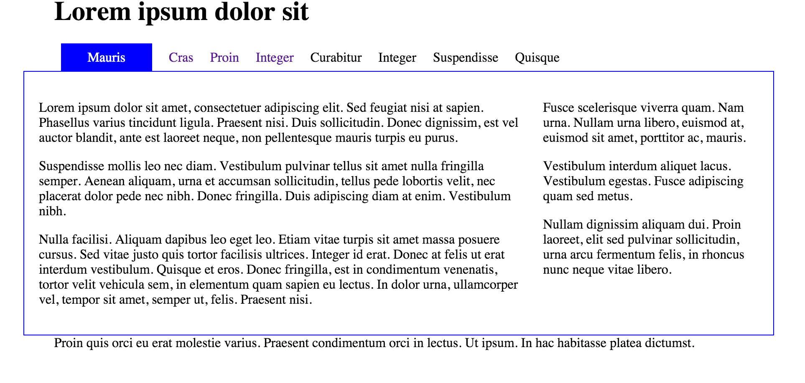

#Styling the Tab

Our page is navigable now, but the user has no real idea of what page they are visting. Then cannot even tell if the list long the top is in fact a navigation panel.

We can do two things to fix this:

## 1: Border

Lets go back to `maincontent` rule - and adjust it as follows:

~~~
#maincontent
{  
  width: 100%;  
  float: right;
  padding: 2%;
  border: blue solid 1px;
}
~~~

As you can see, the content area is framed to give additional visual ques to the user

## 2: Acitve Tab

Now we are ready to `activate` the tabs. Introduce this rule:

~~~
#menu li.current a 
{
  background: blue;
  padding: .5em 2em .5em 2em;
  color:white;
}
~~~

Our page will now have a pleasing tabbed effect:

Your page should behave as follows:

- [Final Version](archives/final/home.html)

This is the final version of the CSS:

~~~
body
{
  width: 80%;  
  margin: 0 auto;
}

#maincontent
{  
  width: 100%;  
  float: right;
  padding: 2%;
  border: blue solid 1px;
}

#navigation
{  
  width: 100%;
  float: left;  
}

#header
{  
  width: 100%;
}

#footer
{  
  width: 100%;
  clear: both;
}

#primary
{  
  width: 68%;  
  float: left;  
}

#secondary
{  
  width: 30%;  
  float: right;
}

ul#menu 
{
  margin: 0;
  padding: 0;
}

ul#menu li 
{
  display:inline; 
  line-height: 2em;
  padding-right: .5em;
  padding-left: .5em;
}

ul#menu a
{
  text-decoration: none;
}

#menu li.current a 
{
  background: blue;
  padding: .5em 2em .5em 2em;
  color:white;
}
~~~
