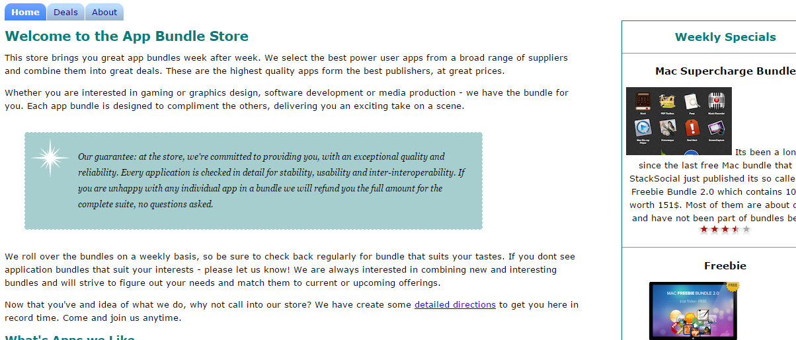

##Exercises

##Completed Lab

This is a complete archive of this lab if you are having difficulty:

- [final.zip](./archives/final.zip)

This is the completed app store lab:

- [lab03.zip](./archives/lab03.zip)

##Exercise 1

We now want to apply the navigation tabs to the app store.

We would like to add a set of tabs for home, deals and about that is positioned just above the main heading.

Work through the steps needed to 

- Add the menu section in your html files
- Name the class and id's correctly
- Add the css rules
- Test to make sure your menu works.

