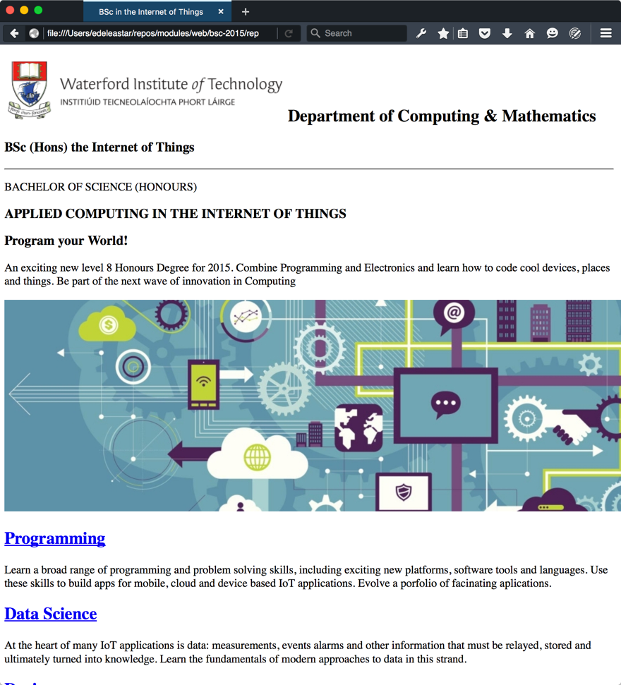
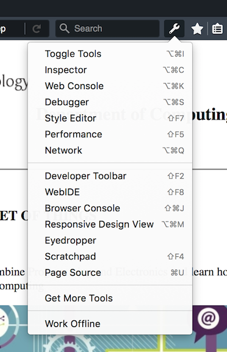
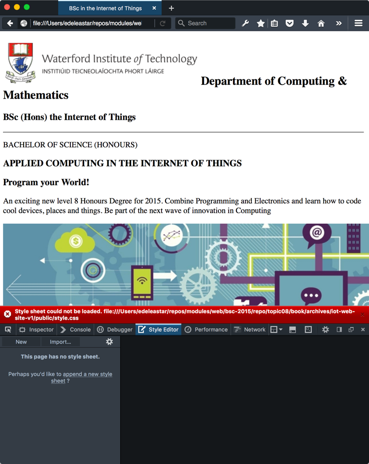

#Setup

Download this archive here:

- [iot-web-site-v01.zip](archives/iot-web-site-v01.zip)

Unzip it somewhere suitable - and open the project in Sublime:

Explore the pages in detail - and note the range of images in the assets folder. Also notice that all of the files are inside the `public` folder of the project.

Browse the pages in you web browser:

- [iot-web-site-v01](archives/iot-web-site-v01/public/index.html)

If you can, download and install:

- [Firefox Developer Edition](https://www.mozilla.org/en-US/firefox/developer/)

and open the site using it instead of chrome:

Explore the 'inspector' options:

and become familiar with some of the tools. The `Style Editor` is particularly interesting:

Note that it is currently showing an error for our site - we are linking to `style.css` in the head, but we haven't provided a css file yet.

###Project so far...

- Browse Web Site: [iot-web-site-v01](./archives/iot-web-site-v01/public/index.html)
- Download Archive: <https://github.com/wit-computing/iot-web/releases/tag/V01>