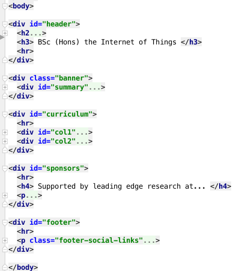
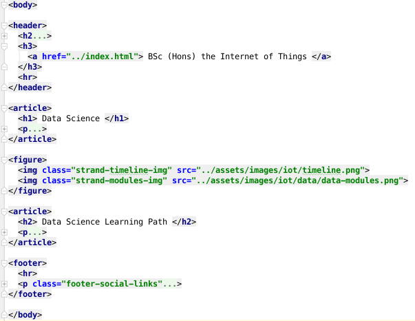

#Semantic HTML

The completed site has a reasonable user experience, but the `Developer Experience` leaves something to be desired. In particular, we are overusing `
` elements, when suitable Semantic Elements are available:

- <http://diveinto.html5doctor.com/semantics.html#new-elements>

The specific elements we will use here are:

- `<section>`
- `<article>`
- `<figure>`
- `<aside>`
- `<header>`
- `<footer>`

This is the `current` layout of the index page:

(nested elements shown in collapsed form)

Rework the index page to use the semantic elements instead of `
`s like this:

Make these changes now - there should be no change in the user experience.

For each of the strand pages, here is what we would like to end up with:

(folded content again).

Adjust all the strand pages to adopt the above structure.

###Project so far...

- Browse Web Site: [iot-web-site-v07](archives/iot-web-site-v07/public/index.html)
- Download Archive: <https://github.com/wit-computing/iot-web/releases/tag/V07>