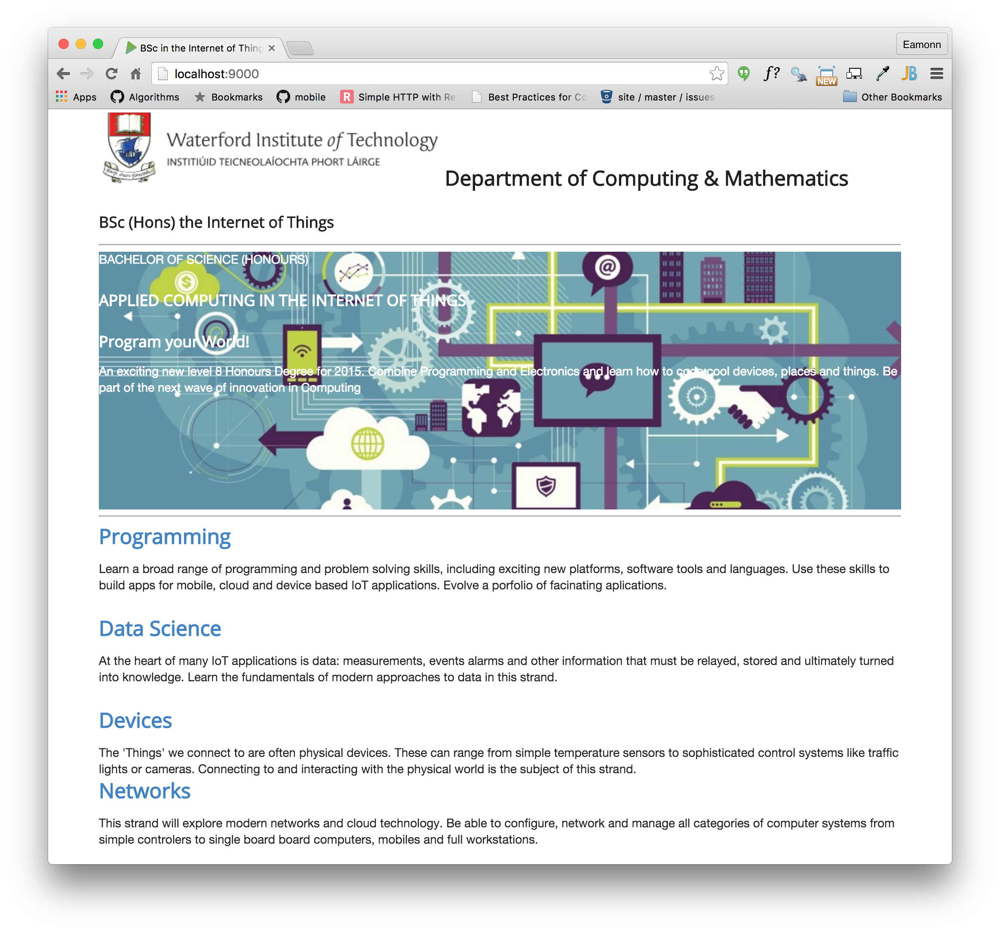

#Container

The `<body>` of our index page looks like this:

~~~
<body>

<header id="header">
  <h2>
    
    Department of Computing &amp; Mathematics
  </h2>

  <h3> BSc (Hons) the Internet of Things </h3>
  

</header>

<article class="banner">
  

    

      BACHELOR OF SCIENCE (HONOURS)
    

    <h3>
      APPLIED COMPUTING IN THE INTERNET OF THINGS
    </h3>

    <h3>
      Program your World!
    </h3>
    

      An exciting new level 8 Honours Degree for 2015. Combine Programming and Electronics and learn how to code cool devices, places and things. Be part of the next wave of innovation in Computing
    

  

</article>

<article id="curriculum">
  

  <section id="col1">
    <h2><a href="strands/programming.html"> Programming </a></h2>
    

      Learn a broad range of programming and problem solving skills, including exciting new platforms, software tools and languages. Use these skills to build apps for mobile, cloud and device based IoT applications. Evolve a porfolio of facinating aplications.
    

    <h2><a href="strands/data.html"> Data Science </a></h2>
    

      At the heart of many IoT applications is data: measurements, events alarms and other information that must be relayed, stored and ultimately turned into knowledge. Learn the fundamentals of modern approaches to data in this strand.
    

    <h2><a href="strands/devices.html"> Devices </a></h2>
    

      The 'Things' we connect to are often physical devices. These can range from simple temperature sensors to sophisticated control systems like traffic lights or cameras. Connecting to and interacting with the physical world is the subject of this strand.
    

  </section>
  <section id="col2">
    <h2><a href="strands/networks.html"> Networks </a></h2>
    

      This strand will explore modern networks and cloud technology. Be able to configure, network and manage all categories of computer systems from simple controlers to single board board computers, mobiles and full workstations.
    

    <h2><a href="strands/project.html"> Project </a></h2>
    

      Building exciting IoT projects in every semester of the programme. Your projects will combine skills acquired from the other strands and enable you to build a comprehensive an compelling portfolio of IoT applications and services.
    

    <h2><a href="strands/maths.html"> Mathematics </a></h2>
    

      Introduce foundation concepts for many of the more applied concepts in the other Strands. Learn mathematical techniques in a modern context and apply core principles in new an interesting ways.
    

  </section>
</article>

<section id="sponsors">
  

  <h4> Supported by leading edge research at... </h4>
  

    
    
    
  

</section>

<footer id="footer">
  

  

    <a href="http://www.facebook.com/witcomp"> facebook </a>
    <a href="http://twitter.com/ComputingAtWIT"> twitter </a>
    <a href="https://ie.linkedin.com/pub/computing-at-wit/a9/221/1b6"> linkedin </a>
  

</footer>

</body>
~~~

Adjust it to the following:

~~~
<section class="ui container">

  <header id="header">

  ... as before

  </footer>

</section>
~~~

This is your first `Semantic-UI` class - more or less replacing the `margin: 0 auto` we were previously using. You can read about the `container` class in semantic's documentation here:

- <http://semantic-ui.com/elements/container.html#/introduction>

Look at some example here to get a feel for the documentation:

- <http://semantic-ui.com/elements/container.html#/definition>

Your page should look like this:

