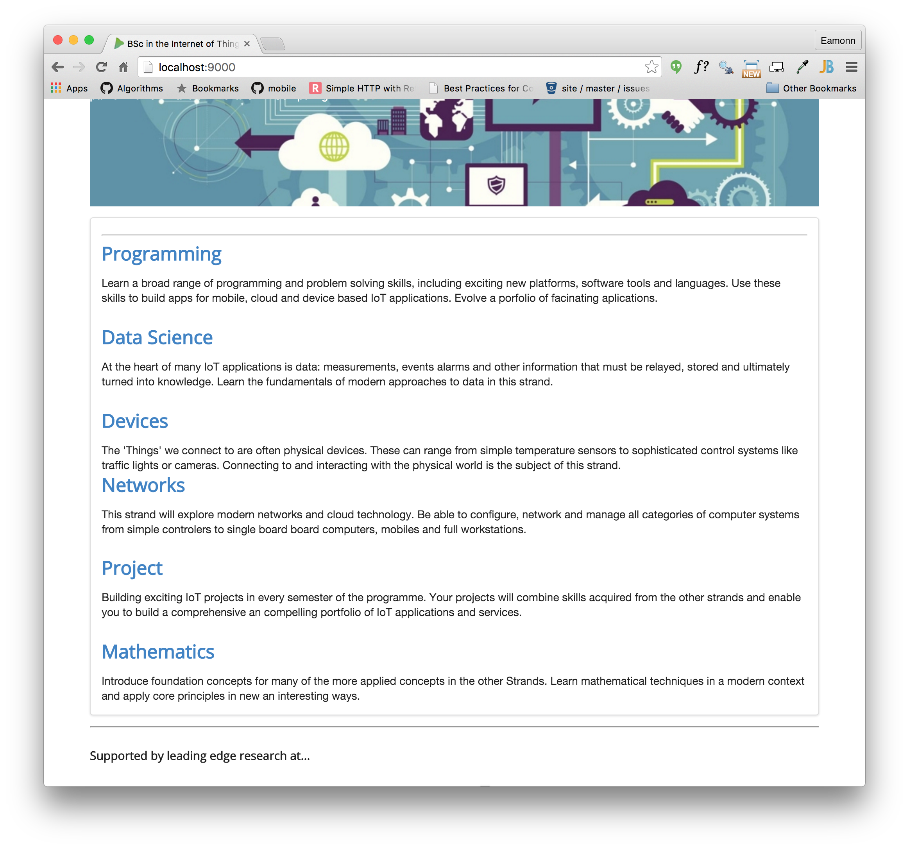
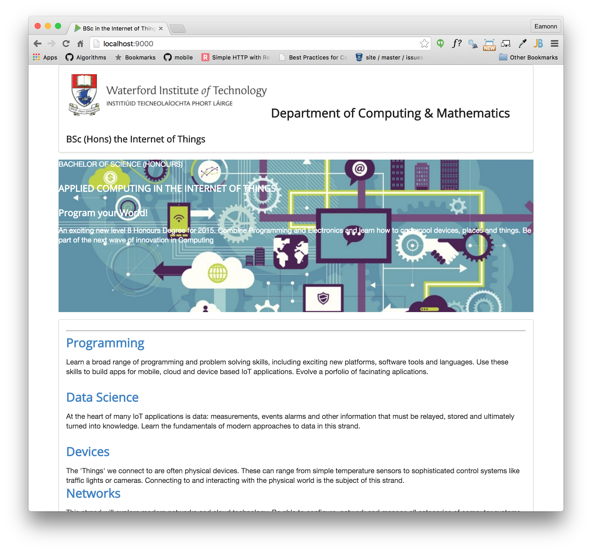

#Segment

The cornerstone of many of the styles in Semantic-UI is the `segment` class:

- <http://semantic-ui.com/elements/segment.html>

Open the home page and locate the `curriculum` article. Make the following changes:

- remove all of the `id`s and `class`s currently in the file.
- give the enclosing article the class `class="ui segment"`

Your curriculum section should know look like this:

~~~
<article class="ui segment">
  

  <section>
    <h2><a href="strands/programming.html"> Programming </a></h2>
    

      Learn a broad range of programming and problem solving skills, including exciting new platforms, software tools and languages. Use these skills to build apps for mobile, cloud and device based IoT applications. Evolve a porfolio of facinating aplications.
    

    <h2><a href="strands/data.html"> Data Science </a></h2>
    

      At the heart of many IoT applications is data: measurements, events alarms and other information that must be relayed, stored and ultimately turned into knowledge. Learn the fundamentals of modern approaches to data in this strand.
    

    <h2><a href="strands/devices.html"> Devices </a></h2>
    

      The 'Things' we connect to are often physical devices. These can range from simple temperature sensors to sophisticated control systems like traffic lights or cameras. Connecting to and interacting with the physical world is the subject of this strand.
    

  </section>
  <section>
    <h2><a href="strands/networks.html"> Networks </a></h2>
    

      This strand will explore modern networks and cloud technology. Be able to configure, network and manage all categories of computer systems from simple controlers to single board board computers, mobiles and full workstations.
    

    <h2><a href="strands/project.html"> Project </a></h2>
    

      Building exciting IoT projects in every semester of the programme. Your projects will combine skills acquired from the other strands and enable you to build a comprehensive an compelling portfolio of IoT applications and services.
    

    <h2><a href="strands/maths.html"> Mathematics </a></h2>
    

      Introduce foundation concepts for many of the more applied concepts in the other Strands. Learn mathematical techniques in a modern context and apply core principles in new an interesting ways.
    

  </section>
</article>
~~~

In the browser it should appear:

Notice the frame around the section.

Do the same for:

header
footer
sponsors.ejs

i.e. replace the 

~~~
<header id="header">
~~~

with 

~~~
<header class="ui segment">
~~~

Also, remove the horizontal rulers (`
`) form all includes. These sections should now be like this:

##header

~~~
  <header class="ui segment">
    <h2>
      
      Department of Computing &amp; Mathematics
    </h2>
    <h3> BSc (Hons) the Internet of Things </h3>
  </header>
~~~

##footer

~~~
<footer class="ui segment">
  

    <a href="http://www.facebook.com/witcomp"> facebook </a>
    <a href="http://twitter.com/ComputingAtWIT"> twitter </a>
    <a href="https://ie.linkedin.com/pub/computing-at-wit/a9/221/1b6"> linkedin </a>
  

</footer>
~~~

##sponsors

~~~
<section class="ui segment">
  <h4> Supported by leading edge research at... </h4>
  

    
    
    
  

</section>
~~~

The pages will start to look like this:

