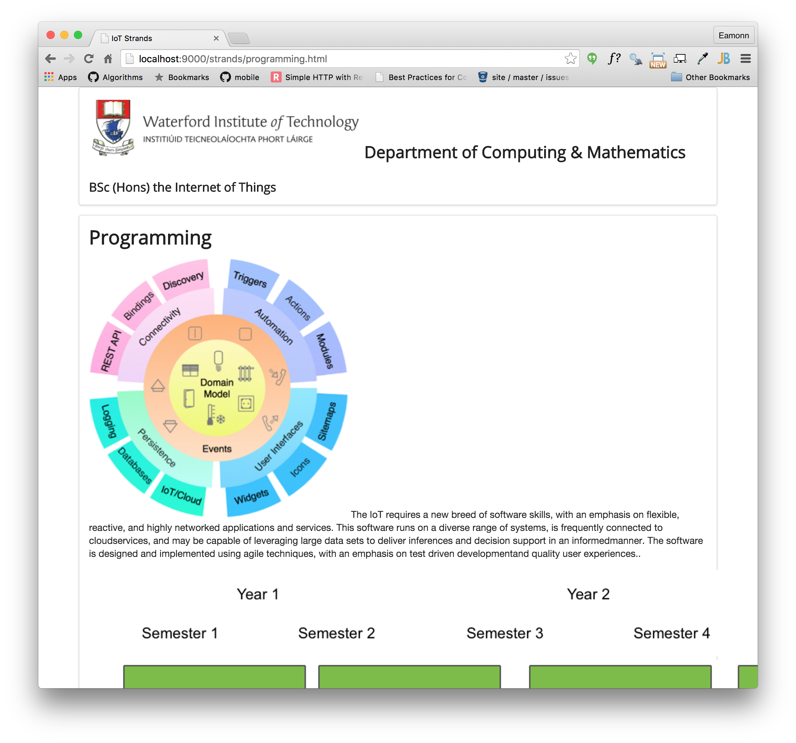

#Strands

We need to make similar adjustments to all of the pages in the strands folder.

Replace the head section with the version to include Semantic-ui

~~~
<head>
  <meta charset="UTF-8">
  <link rel="stylesheet" type="text/css" href="http://fonts.googleapis.com/css?family=Open+Sans" />
  <link rel="stylesheet" href="../assets/semantic/semantic.css">
  <link type="text/css" rel="stylesheet" href="style.css" media="screen"/>
  <title>BSc in the Internet of Things</title>
</head>
~~~

And the for each page, introduce the section wrapper:
~~~

<body>
  <section class="ui container">
    ... existing headder section
    <section class="ui segment">
      ... the article and figures on the page
    </section>
    ... existing footer section
  <section>
</body>
~~~

It includes the semantic.css in the header, and also `container` and `segment` styles. We do this once, and all the pages in the strands folder will be updated:

Here is the complete data page in case you need further guidance:

~~~
<!DOCTYPE html>
<html lang="en">
<head>
  <meta charset="UTF-8">
  <link rel="stylesheet" type="text/css" href="http://fonts.googleapis.com/css?family=Open+Sans" />
  <link rel="stylesheet" href="../assets/semantic/semantic.css">
  <link type="text/css" rel="stylesheet" href="style.css" media="screen"/>
  <title>BSc in the Internet of Things</title>
</head>
<body>

<section class="ui container">

  <header>
    <h2>
      
      Department of Computing &amp; Mathematics
    </h2>
    <h3>
      <a href="../index.html"> BSc (Hons) the Internet of Things </a>
    </h3>
    

  </header>

  <section class="ui segment">

    <article>
      <h1> Data Science </h1>
      

        
        The Internet of Things (IoT) has the potential to generate massive amounts of data that will demonstrate most of the characteristics of the Big Data. A single IoT system will incorporate a multitude of diverse devices generating a constant stream of data relevant to a variety of IoT applications. While most of the data will hold short term practical value (e.g. temperature readings, air pressure values), deep analysis of the historical data can provide a meaningful insight of high potential value. Such insight may relate to a particular IoT application (e.g. business analytics) as well as operation of the IoT system itself (operational analytics). The analysis of the IoT data will encompass descriptive, predictive and prescriptive business analytics with operational analytics closely linked to the growth of the IoT system. Operational analytics will be driven by data that is sourced from all things included into the IoT system. Consequently the IoT requires a new skill-set for data governance and analyses.
      

    </article>

    <figure>
      
      
    </figure>

    <article>
      <h2> Data Science Learning Path </h2>
      

        
        The Programming Stand will start with an introduction to the discipline of problem solving, establishing a firm foundation in the skill set needed for basic algorithm and data structure formation. Concurrently, students will be introduced to web technologies and be encouraged to apply their new skills to the creation of interesting websites and applications. Second year will see the students deepen their core programming knowledge, covering the fundamental algorithms and data structures, with an emphasis on understanding the trade-offs associated with performance, efficiency and resource consumption. They will continue to implement interesting applications, with a focus on cloud hosted web services. By third year they will have the competence to take on a major application platform with an in depth module on modern App development. In final year they will return to the Web Technologies, but this time with a more sophisticated tool set and deeper understanding of the issues. This will culminate in an exploration of emerging IoT platforms, their characteristics and likely trajectories.
      

    </article>

   </section> 

  <footer>
    

    

      <a href="http://www.facebook.com/witcomp"> facebook </a>
      <a href="http://twitter.com/ComputingAtWIT"> twitter </a>
      <a href="https://ie.linkedin.com/pub/computing-at-wit/a9/221/1b6"> linkedin </a>
    

  </footer>

</section>

</body>
</html>
~~~

