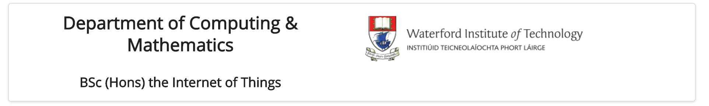

#Grids I

This is our current header section:

~~~
<header class="ui segment">
  <h2>
    
    Department of Computing &amp; Mathematics
  </h2>
  <h3> BSc (Hons) the Internet of Things </h3>
</header>
~~~

And this is how it renders:

Not very attractive layout!

Our objective is to get it looking something like this:

In the above we seem to have two columns - and the images and text are nicely proportioned, aligned and spaced. How do we do this?

This is the semantic-ui grid class:

- <http://semantic-ui.com/collections/grid.html>

..and here is a first attempt at establishing a grid:

~~~
<header class="ui two column grid segment">
  

    <h2 class="ui header"> Department of Computing &amp; Mathematics </h2>
    <h3 class="ui header"> BSc (Hons) the Internet of Things </h3>
  

  

    

      
    

  

</header>
~~~

Try this out now - it should look like this:

Not quite there yet - but the two columns should be visible.

Change the header class to the following:

~~~
<header class="ui two column center aligned grid segment">
~~~

Can you see an improvement?

Now change the image element to the following:

~~~
      
~~~

Finally, change the header again to this:

~~~
<header class="ui two column center aligned middle aligned grid segment">
~~~

.. and see the difference:

This is the complete  header section

~~~
<header class="ui two column center aligned middle aligned grid segment">
  

    <h2 class="ui header"> Department of Computing &amp; Mathematics </h2>
    <h3 class="ui header"> BSc (Hons) the Internet of Things </h3>
  

  

    

      
    

  

</header>
~~~

The alignment is part of the `segment` properties - and you can read about it here:

- <http://semantic-ui.com/elements/segment.html#text-alignment>

Now, replace all of the head sections on the strand pages with this new version:

~~~
  <header class="ui two column center aligned middle aligned grid segment">
    

      <h2 class="ui header"> Department of Computing &amp; Mathematics </h2>
      <h3 class="ui header"> BSc (Hons) the Internet of Things </h3>
    

    

      

        
      

    

  </header>

~~~

(This has the path to semantic adjusted)

