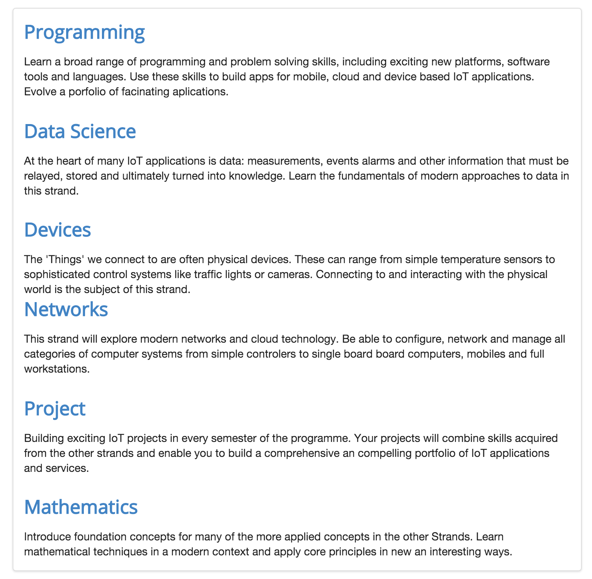
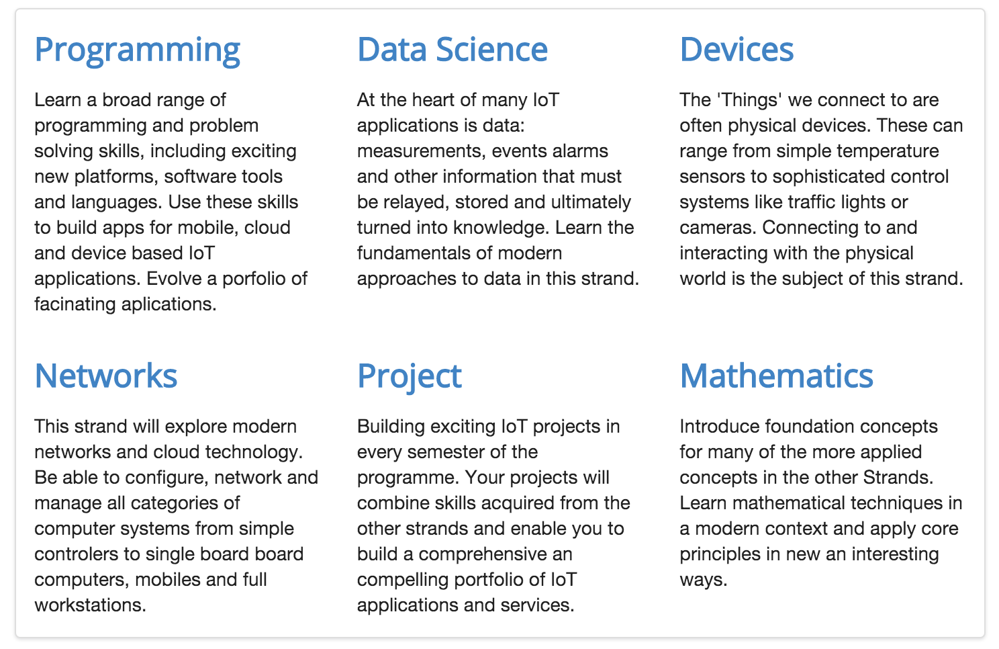

#Grids III

Currently our curriculum section looks like this:

We would like the reformat it as follows:

This is the current source:

~~~
<article class="ui segment">
  <section>
    <h2><a href="strands/programming.html"> Programming </a></h2>
    

      Learn a broad range of programming and problem solving skills, including exciting new platforms, software tools and languages. Use these skills to build apps for mobile, cloud and device based IoT applications. Evolve a porfolio of facinating aplications.
    

    <h2><a href="strands/data.html"> Data Science </a></h2>
    

      At the heart of many IoT applications is data: measurements, events alarms and other information that must be relayed, stored and ultimately turned into knowledge. Learn the fundamentals of modern approaches to data in this strand.
    

    <h2><a href="strands/devices.html"> Devices </a></h2>
    

      The 'Things' we connect to are often physical devices. These can range from simple temperature sensors to sophisticated control systems like traffic lights or cameras. Connecting to and interacting with the physical world is the subject of this strand.
    

  </section>
  <section>
    <h2><a href="strands/networks.html"> Networks </a></h2>
    

      This strand will explore modern networks and cloud technology. Be able to configure, network and manage all categories of computer systems from simple controlers to single board board computers, mobiles and full workstations.
    

    <h2><a href="strands/project.html"> Project </a></h2>
    

      Building exciting IoT projects in every semester of the programme. Your projects will combine skills acquired from the other strands and enable you to build a comprehensive an compelling portfolio of IoT applications and services.
    

    <h2><a href="strands/maths.html"> Mathematics </a></h2>
    

      Introduce foundation concepts for many of the more applied concepts in the other Strands. Learn mathematical techniques in a modern context and apply core principles in new an interesting ways.
    

  </section>
</article>
~~~

Using the grid system, we divide the section int two rows:

~~~
<section class="ui grid segment">

  <section class="ui three column row">
    <article class="column">
       ... code for the first column
    </article>
    <article class="column">
       ... code for the seconod column
    </article>
    <article class="column">
       ... code for the third column
    </article>
  </section>

  <section class="ui three column row">
    <article class="column">
       ... code for the first column
    </article>
    <article class="column">
       ... code for the second column
    </article>
    <article class="column">
       ... code for the third column
    </article>
  </section>

</section>
~~~

Can you see the structure?

Here is the complete section:

~~~
  <article class="ui grid segment">

    <section class="ui three column row">
      <article class="column">
        <h2> <a href="strands/programming.html"> Programming </a> </h2>
        

          Learn a broad range of programming and problem solving skills, including exciting new platforms, software tools and
          languages. Use these skills to build apps for mobile, cloud and device based IoT applications. Evolve a porfolio of
          facinating aplications.
        

      </article>
      <article class="column">
        <h2> <a href="strands/data.html"> Data Science </a></h2>
        

          At the heart of many IoT applications is data: measurements, events alarms and other information that must be relayed, stored and ultimately turned into knowledge. Learn the fundamentals of modern approaches to data in this strand.
        

      </article>
      <article class="column">
        <h2> <a href="strands/devices.html"> Devices </a></h2>
        

          The 'Things' we connect to are often physical devices. These can range from simple temperature sensors to sophisticated control systems like traffic lights or cameras. Connecting to and interacting with the physical world is the subject of this strand.
        

      </article>
    </section>

    <section class="ui three column row">
      <article class="column">
        <h2> <a href="strands/networks.html"> Networks </a></h2>
        

          This strand will explore modern networks and cloud technology. Be able to configure, network and manage all categories of computer systems from simple controlers to single board board computers, mobiles and full workstations.
        

      </article>

      <article class="column">
        <h2> <a href="strands/project.html"> Project </a></h2>
        

          Building exciting IoT projects in every semester of the programme. Your projects will combine skills acquired from the other strands and enable you to build a comprehensive an compelling portfolio of IoT applications and services.
        

      </article>

      <article class="column">
        <h2> <a href="strands/maths.html"> Mathematics </a></h2>
        

          Introduce foundation concepts for many of the more applied concepts in the other Strands. Learn mathematical techniques in a modern context and apply core principles in new an interesting ways.
        

      </article>
    </section>
    
  </article>
~~~

Which should look like this:

Note the use of blank lines in the code to help keep the structure readable.
