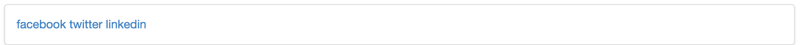

#Icons

We left the footer from last week looking like this:

with the task of making it look like this:

To do this, we can make use of the icons in Semantic-UI:

- <http://semantic-ui.com/elements/icon.html>

This is the current footer:

~~~
<footer class="ui segment">
  

    <a href="http://www.facebook.com/witcomp"> facebook </a>
    <a href="http://twitter.com/ComputingAtWIT"> twitter </a>
    <a href="https://ie.linkedin.com/pub/computing-at-wit/a9/221/1b6"> linkedin </a>
  

</footer>
~~~

It is just links with an icons. Here is a replacement:

~~~
<footer class="ui center aligned segment">
  <a href="http://www.facebook.com/witcomp"> <i class="large facebook icon"></i> </a>
  <a href="href='http://twitter.com/ComputingAtWIT"> <i class="large twitter icon"></i> </a>
  <a href="href='http://www.linkedin.com/pub/computing-at-wit">  <i class="large linkedin icon"></i> </a>
</footer>
~~~
