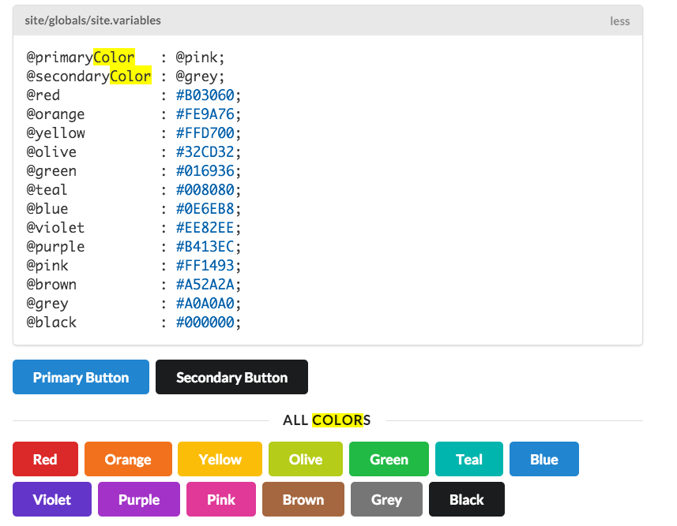
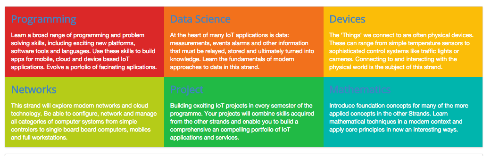

#Background colours

We will make the curriculum a little more eye catching but introducing some colour into each of the columns.

The framework defines a set of colours we can use:

(<http://semantic-ui.com/usage/theming.html>)

... and these can be used to give an entire section a colour:

##curriculum section

~~~
...
    <article class="red column">
      <h2> <a href="strands/programming.html"> Programming </a> </h2>
      

        Learn a broad range of programming and problem solving skills, including exciting new platforms, software tools and
        languages. Use these skills to build apps for mobile, cloud and device based IoT applications. Evolve a porfolio of
        facinating aplications.
      

    </article>
...
~~~

Which will look like this:

Note that the colour of the header is clashing with the new background colour - but also note that the paragraph text has been automatically coloured to white.

Recolour all sections now:

~~~
...
  <section class="ui three column row">

    <article class="red column">
      ...
    </article>

    <article class="orange column">
      ...
    </article>

    <article class="yellow column">
      ...
    </article>

  </section>

  <section class="ui three column row">

    <article class="olive column">
      ...
    </article>

    <article class="green column">
      ...
    </article>

    <article class="teal column">
      ...
    </article>

  </section>
...
~~~

