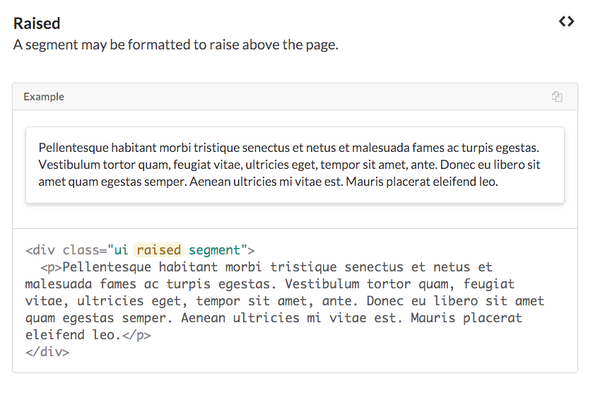
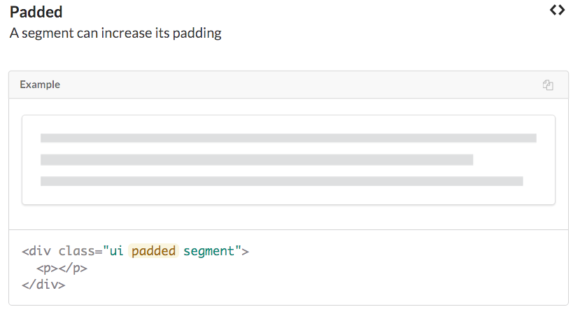
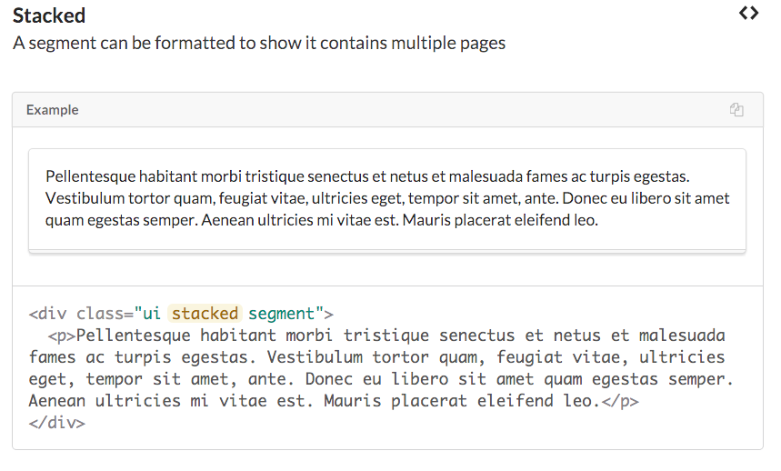
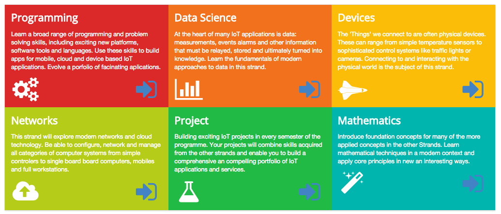
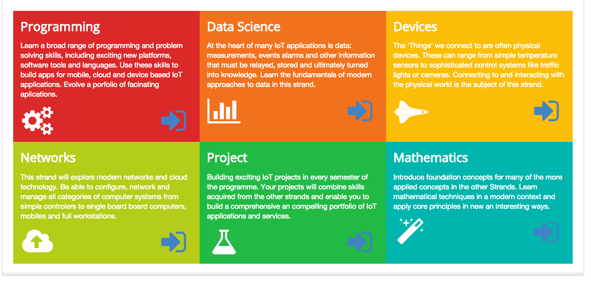
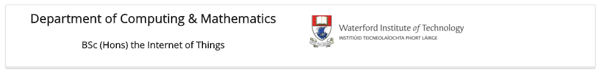

#Padding, Raised and Stacked Segments 

The range of options available for the `segment` class is worth exploring in detail:

- <http://semantic-ui.com/elements/segment.html>

Specifically :

Contrast the following two version of the curriculum section:

The latter has the following adjustments to its section class:

~~~
<section class="ui three column padded stacked grid segment">
~~~

Type 'stacked' in the other segments. Eg. the header:

