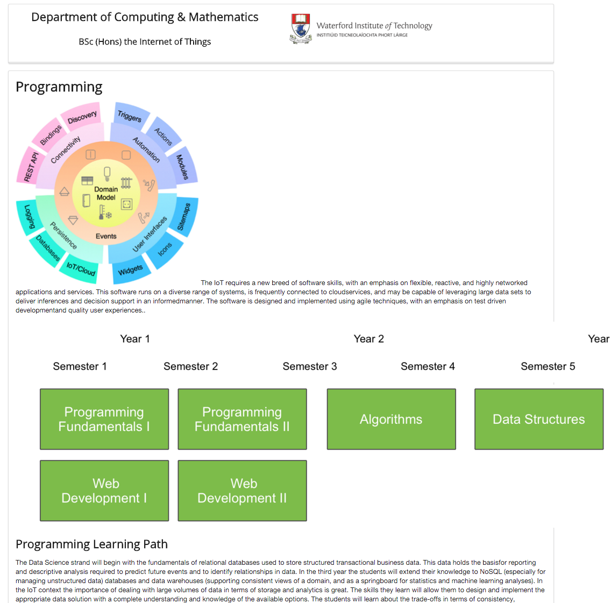
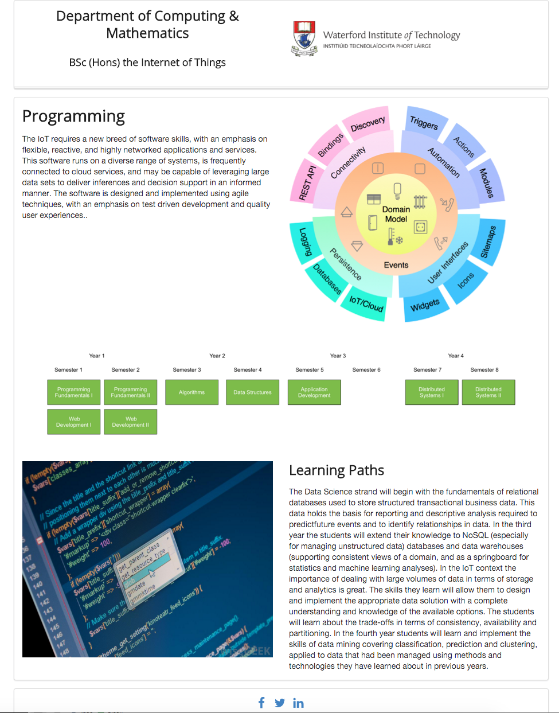

#Strand pages

Our strand pages are still not rendering correctly:

The images are not sized correctly, and the text is not flowing well. This is how we would like it to look:

This is the current main content of programming.html (ignoring head, headder and footer for the moment):

~~~
 <section class="ui segment">
    <article>
      <h1> Programming </h1>
      

        
        The IoT requires a new breed of software skills, with an emphasis on flexible, reactive, and highly networked applications and services. This software runs on a diverse range of systems, is frequently connected to cloudservices, and may be capable of leveraging large data sets to deliver inferences and decision support in an informedmanner. The software is designed and implemented using agile techniques, with an emphasis on test driven developmentand quality user experiences..
      

    </article>

    <figure>
      
      
    </figure>

    <article>
      <h2> Programming Learning Path </h2>
      

        The Data Science strand will begin with the fundamentals of relational databases used to store structured transactional business data. This data holds the basisfor reporting and descriptive analysis required to predict future events and to identify relationships in data. In the third year the students will extend their knowledge to NoSQL (especially for managing unstructured data) databases and data warehouses (supporting consistent views of a domain, and as a springboard for statistics and machine learning analyses). In the IoT context the importance of dealing with large volumes of data in terms of storage and analytics is great. The skills they learn will allow them to design and implement the appropriate data solution with a complete understanding and knowledge of the available options. The students will learn about the trade-offs in terms of consistency, availability and partitioning. In the fourth year students will learn and implement the skills of data mining covering classification, prediction and clustering, applied to data that had been managed using methods and technologies they have learned about in previous years.
      

    </article>
  </section>
~~~

In order to improve the layout, we will need to incorporate a grid:

~~~
 <section class="ui grid segment">
    <article>
      <h1> Programming </h1>
      

        
        The IoT requires a new breed of software skills, with an emphasis on flexible, reactive, and highly networked applications and services. This software runs on a diverse range of systems, is frequently connected to cloudservices, and may be capable of leveraging large data sets to deliver inferences and decision support in an informedmanner. The software is designed and implemented using agile techniques, with an emphasis on test driven developmentand quality user experiences..
      

    </article>

    <figure>
      
      
    </figure>

    <article>
      <h2> Programming Learning Path </h2>
      

        The Data Science strand will begin with the fundamentals of relational databases used to store structured transactional business data. This data holds the basisfor reporting and descriptive analysis required to predict future events and to identify relationships in data. In the third year the students will extend their knowledge to NoSQL (especially for managing unstructured data) databases and data warehouses (supporting consistent views of a domain, and as a springboard for statistics and machine learning analyses). In the IoT context the importance of dealing with large volumes of data in terms of storage and analytics is great. The skills they learn will allow them to design and implement the appropriate data solution with a complete understanding and knowledge of the available options. The students will learn about the trade-offs in terms of consistency, availability and partitioning. In the fourth year students will learn and implement the skills of data mining covering classification, prediction and clustering, applied to data that had been managed using methods and technologies they have learned about in previous years.
      

    </article>
  </section>
~~~

... we have made the main section a `grid` segment.

We can then rework the internals to use the grid model:

~~~
  <section class="ui grid segment">
  
    <article class="eight wide column">
      <h1> Programming </h1>
      

        The IoT requires a new breed of software skills, with an emphasis on flexible, reactive, and highly networked applications and services. This software runs on a diverse range of systems, is frequently connected to cloud services, and may be capable of leveraging large data sets to deliver inferences and decision support in an informed manner. The software is designed and implemented using agile techniques, with an emphasis on test driven development and quality user experiences..
      

    </article>

    <aside class="eight wide column">
      
     </aside>

    <figure class="sixteen wide column">
      
      
    </figure>

    <aside class="eight wide column">
      
    </aside>

    <section class="eight wide column">
      <h2> Learning Paths </h2>
      

        The Data Science strand will begin with the fundamentals of relational databases used to store structured transactional business data. This data holds the basis for reporting and descriptive analysis required to predictfuture events and to identify relationships in data. In the third year the students will extend their knowledge to NoSQL (especially for managing unstructured data) databases and data warehouses (supporting consistent views of a domain, and as a springboard for statistics and machine learning analyses). In the IoT context the importance of dealing with large volumes of data in terms of storage and analytics is great. The skills they learn will allow them to design and implement the appropriate data solution with a complete understanding and knowledge of the available options. The students will learn about the trade-offs in terms of consistency, availability and partitioning. In the fourth year students will learn and implement the skills of data mining covering classification, prediction and clustering, applied to data that had been managed using methods and technologies they have learned about in previous years.
      

    </section>

  </section>
~~~

We are using the 16-column grid as defined by semantic. Every time we are specifying `eight wide column` we are effectively consuming half of the available width. A `sixteen wide column' is then the full width. 

Note also we are using the class `ui image` for the images. This is an important addition, ensuring the images are correctly sized for the available space:

- <http://semantic-ui.com/elements/image.html>

Make sure you can relate the above use of these grid parameters to the actual layout.

When you get this working - adapt all of the strand pages to follow a similar model.

