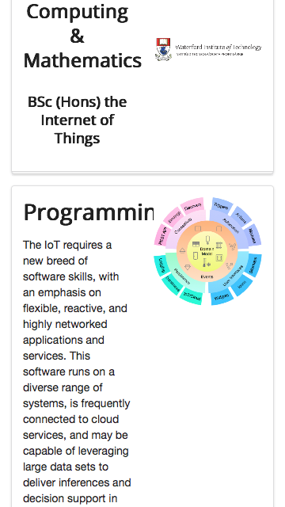
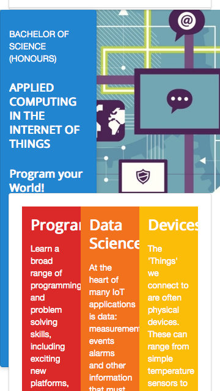
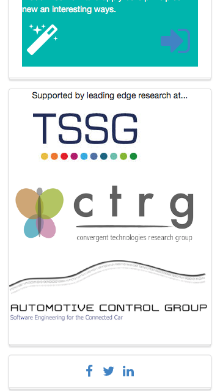

#Responsive Grids

Try narrowing making the browser very narrow - like this:

... and this:

Although the images are resized - the home page becomes unreadable as the width shrinks. This would imply our page is 'unresponsive' - it cannot adequately render on a small form factor device in a legible manner.

One of the keys to responsive design in semantic are options available in the grid system:

- <http://semantic-ui.com/collections/grid.html>

Particularly the `Responsive Grids` - and `Stackable` grids in particular:

- <http://semantic-ui.com/collections/grid.html#stackable>

Back to the curriculum section of the home page - adjust the enclosing `<section>` with a new class - `stackable`:

~~~
<section class="ui three column padded stacked stackable grid segment">
~~~

Immediately the grid becomes more readable:

We can also apply `stackable` to the headers and sponsors sections - which will render on narrow screens like this:

Try this now and make sure your site is responding as above on small screen sizes.

