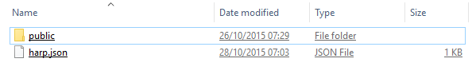

#Deploying a Web Site using Surge

Create a new project com the command line by entering the following:

~~~
harp init iot-web
~~~

Remember, make sure to keep an eye on which folder this command is executed from. Opening the folder should reveal these files:

We will use files like these later - but for the moment delete all of these files and replace them with the following file called `harp.json`:

##harp.json

~~~
{
  "globals": 
  {

  }
}
~~~

If you havent already downloaded it - get the last version of the IoT web site from the last lab:

- Download Archive: <https://github.com/wit-computing/iot-web/releases/tag/Lab05b>

Unzip the project, and copy the `public` folder into the iot-web folder you have just created. Your `iot-web` folder should look like this:

Now we will `serve` the web site locally with this command:

~~~
C:> cd iot-web
C:\iot-web> harp server
Your server is listening at http://localhost:9000/
Press Ctl+C to stop the server
~~~

Notice that the command is executed form within the `iot-web` directory.

Verify that the site is available here:

- <http://localhost:9000/>

Terminate the server again with ^C:

~~~
Your server is listening at http://localhost:9000/
Press Ctl+C to stop the server
Terminate batch job (Y/N)? y
^C
C:\iot-web>
~~~

From still within the `iot-folder`, enter the following command:

~~~
C:\iot-web> surge
    Welcome to Surge!
    Please login or create an account by entering your email and password:
~~~

Enter credential to create a new account now - be sure to remember the password. Surge will then deploy the site to a public server:

~~~
  project path: C:\dev\iot-web\
               size: 34 files, 2.3 MB
             domain: dull-pet.surge.sh
             upload: [====================] 100%, eta: 0.0s
   propagate on CDN: [====================] 100%
               plan: Free
              users: youremail@domain.com
         IP address: 192.241.214.148

    Success! Project is published and running at dull-pet.surge.sh
~~~

The `domain` can be customised -in the above example 'dull-pet' was generated, you can replace this with something more suitable (but unique, so perhaps include your initials, the current date or something that may not be used by someone else).

Open a browser to inspect the running site. This is now deployed and accessible globally!
