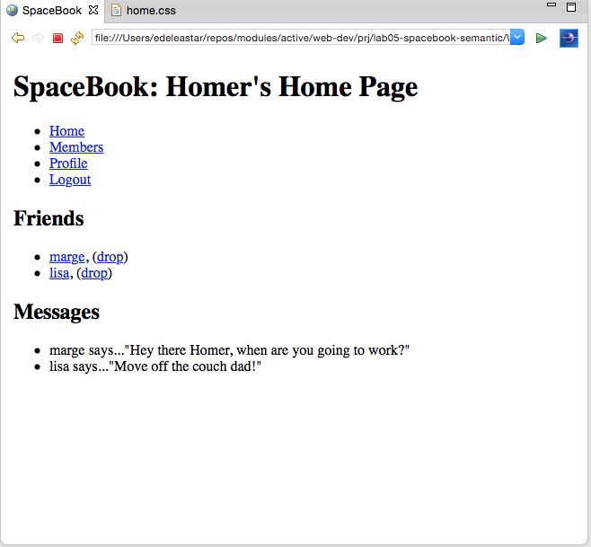
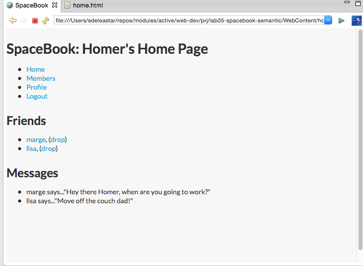

#Setup

Download and unzip thie project:

- [spacebook.zip](./archives/spacebook-static.zip)

Open in both sublime and in a browser and explore the site.

Create new folder called spacebook-semantic - and copy over all the files from the above project into this new project

Visit :

- <a href="http://semantic-ui.com" target="_blank"> Semantic UI </a>

and download the archive.

Extract the archive. It contains a folder called 'dist'. Rename this folder to 'semantic', and copy this folder into your WebContent folder in your new project.

Your project may now look like this:

- [spacebook-static](./archives/spacebook-static/home.html)

Remove all of contents of 'home.css' - but leave the file itself in place. This will remove all styles, so your home page should look like this:

Most of the links should work - but all pages should be unstyled.

##semanitc.css

Into the head of home.html, introduce the following entry:

~~~
    <link type="text/css" rel="stylesheet" href="semantic/semantic.min.css" media="screen" />
~~~

This will include the semantic style sheet into your home page. It will immediately be restyled something like this:

Place the above link is all the pages in the project. You should see small changes in the style throught the site consistent with the above image.

