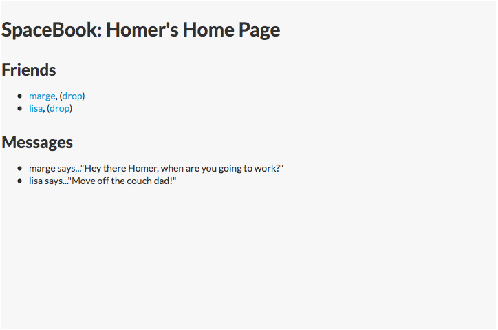
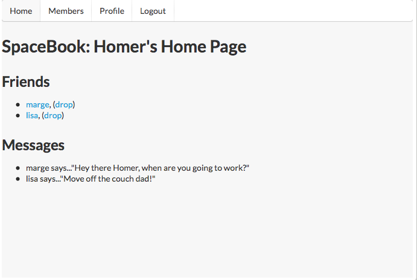
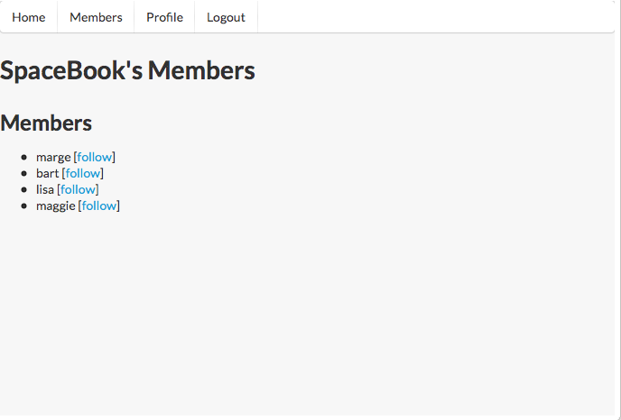
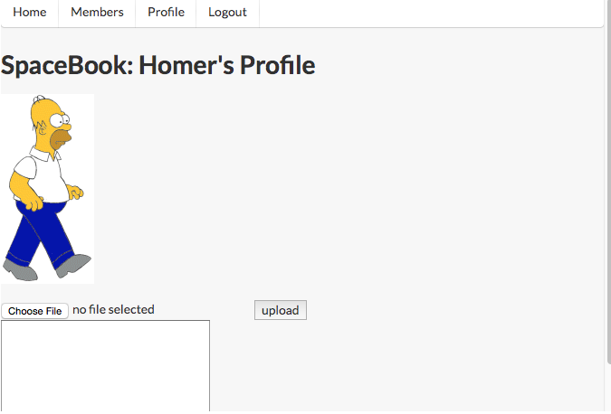

#Menu

Move the navigation section to top of body (to before the header):

~~~html
  <body id="home">
     

      <ul id="tabs">
        <li id="home">    <a href="home.html">Home</a>     </li>
        <li id="members"> <a href="members.html">Members</a>  </li>
        <li id="homreprofile"> <a href="homeprofile.html">Profile</a>  </li>
        <li id="logout">  <a href="login.html">Logout</a>   </li>
      </ul>
    

    

      <h1>SpaceBook: Homer's Home Page</h1>
    

~~~

Remove `<ul>` and `<li>` elements from within 'navigation' and change the id from navigation to the class ui menu:

~~~html
    

      <a href="home.html">Home</a>
      <a href="members.html">Members</a>  
      <a href="homeprofile.html">Profile</a>  
      <a href="login.html">Logout</a>
    

~~~

Remove the 'id="home" from the body element, and replace the div element with a nav

~~~
  <body>
    <nav class="ui menu">
      <a href="home.html">Home</a>
      <a href="members.html">Members</a>  
      <a href="homeprofile.html">Profile</a>  
      <a href="login.html">Logout</a>
    </nav>
~~~

Examining the page in the browser, we see the navigation section is no longer even visible:

Introduce class for each menu item as shown:

~~~html
      <a class="ui item" href="home.html">Home</a>
      <a class="ui item" href="members.html">Members</a>  
      <a class="ui item" href="homeprofile.html">Profile</a>  
      <a class="ui item" href="login.html">Logout</a>
~~~

This should introduce a tab like menu along the top:

Replicate the above in:

- members.html
- homeprofile.html

##Exercise:

Explore alternative Menu styles here:

- <a href="http://semantic-ui.com/collections/menu.html" target="_blank"> Semantic UI Menus </a>

In this documentation, the '<>' icon allows you to reveal the html used to achieve the various effects. See if you can make sense of one or two of the effects, and try them out in your menus.

