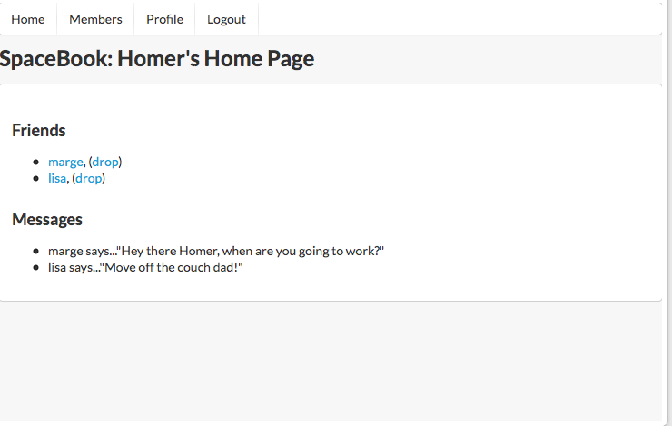

#Sections and Articles

The 'maincontent' div of the home page currently looks like this:

~~~
    

      
     
        <h2> Friends </h2> 
        <ul> 
          <li><a href="marge.html">marge</a>, (<a href="drop/marge">drop</a>)</li> 
          <li><a href="lisa.html">lisa</a>, (<a href="drop/lisa">drop</a>)</li> 
        </ul>
      
  
      

        <h2> Messages </h2> 
        <ul> 
          <li>marge says..."Hey there Homer, when are you going to work?"</li>      
          <li>lisa says..."Move off the couch dad!"</li>     
        </ul>      
      

    

~~~

Contrast the above with this version:

~~~
    <section>
      <article>     
        <h3> Friends </h3> 
        <ul> 
          <li><a href="marge.html">marge</a>, (<a href="drop/marge">drop</a>)</li> 
          <li><a href="lisa.html">lisa</a>, (<a href="drop/lisa">drop</a>)</li> 
        </ul>
      </article>  
      <article>
        <h3> Messages </h3> 
        <ul> 
          <li>marge says..."Hey there Homer, when are you going to work?"</li>      
          <li>lisa says..."Move off the couch dad!"</li>     
        </ul>      
      </article>
    </section>
~~~    

Note we are moving to using `<section>` and `<article>` elements for greater readability of the document. There should be no change in the UX - as the above are 'semantic' (in the html5 sense) elements. These are now more correctly called 'section' elements, and are discussed here:

- <a href="http://www.w3.org/html/wg/drafts/html/master/sections.html#sections" target="_blank"> HTML Sections </a>

##Segments

Semantic UI has the notion of a 'segment' (as opposed to sections), which offers some interesting options:

- <a href="http://semantic-ui.com/elements/segment.html" target="_blank"> HTML Sections </a>

~~~html
    <section class="ui segment">
~~~

Introducing it in the above should give you a subtle change:

Reproduce the above structure in all pages.

Your version should now start to resemble this:

- <a href="archives/before-grid/home.html" target="_blank"> Spacebook Semantic </a>

#Exercise

Explore alternative segment styles here:

- <a href="http://semantic-ui.com/elements/segment.html" target="_blank"> HTML Sections </a>

