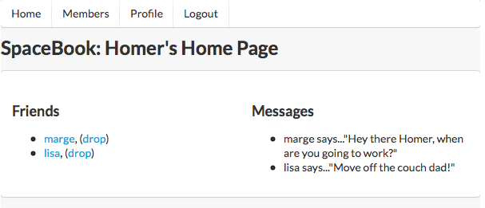

#Grid

Examine the main section on 'home.html' again - and make the adjustments shown below:

~~~html
    <section class="ui two column grid segment">
      <article class="ui column">     
        <h3> Friends </h3> 
        <ul> 
          <li><a href="marge.html">marge</a>, (<a href="drop/marge">drop</a>)</li> 
          <li><a href="lisa.html">lisa</a>, (<a href="drop/lisa">drop</a>)</li> 
        </ul>
      </article>  
      <article class="ui column">
        <h3> Messages </h3> 
        <ul> 
          <li>marge says..."Hey there Homer, when are you going to work?"</li>      
          <li>lisa says..."Move off the couch dad!"</li>     
        </ul>      
      </article>
    </section>
~~~

This will have a dramatic effect on the page layout:

Do same for homeprofile:

~~~
    <section class="ui two column grid segment">
      <article class="ui column">    
        
 
           
        
 
        <form action="homeprofile/upload" method="post" enctype="multipart/form-data">  
          <input type="file" name="userfile" value=""  />     
          <input type="submit" name="submit" value="upload"  />  
        </form>  
      </article>  
      <article class="ui column">
        <form action="homeprofile/changetext" method="post">         
          <textarea name="profiletext" cols="30" rows="8" ></textarea>  
          <input type="submit" name="submit" value="Change"  /> 
        </form>
      </article>
    </section>
~~~

##Grid System

Explore the grid system here:

- <a href="http://semantic-ui.com/collections/grid.html" target="_blank"> Semantic UI </a>

(Including the 'very rich history' article when you have time!)

The mechansisms here completely replace the floating/clearing and nesting + width dimensions of the legacy CSS we carried in to this project. We have just touched the surface here - establishing a effective 2 column layout with very little effort.

