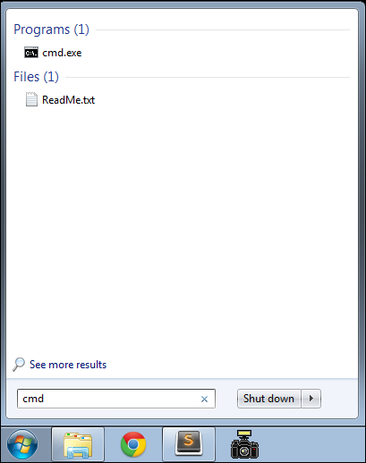

#Command Prompt

Open a command prompt on Windows. The easiest way to do this is in Windows 7 to type 'cmd' in the Search Box on the Windows start menu:

When you type it, the start menu might change to the following:

...and if you press return, then the command window itself will appear:

On Windows 8 and 10, access the desktop from the home screen, and run File Explorer (may be in the toolbar). Then select File->Open Command Prompt:

