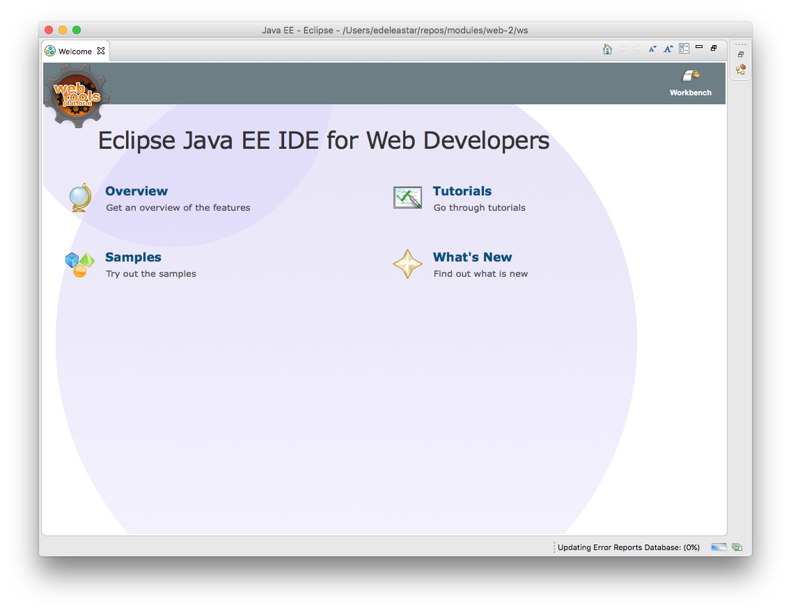
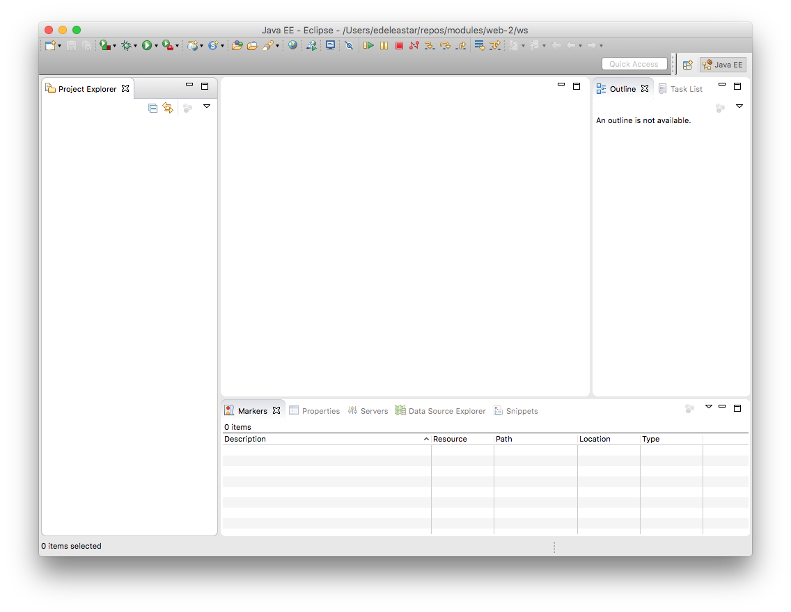
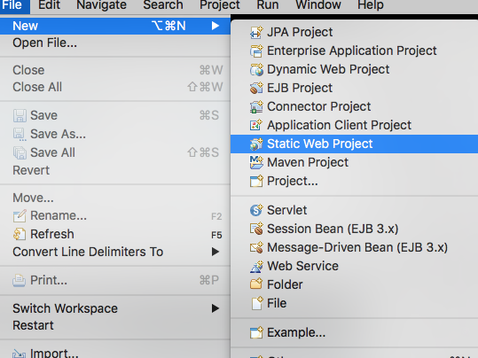
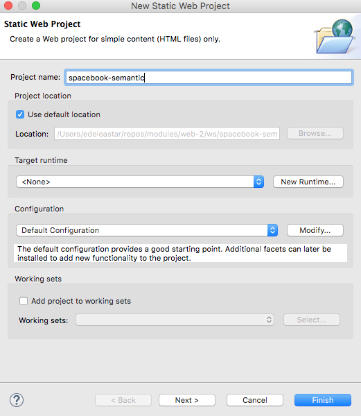
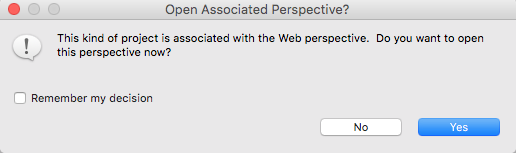
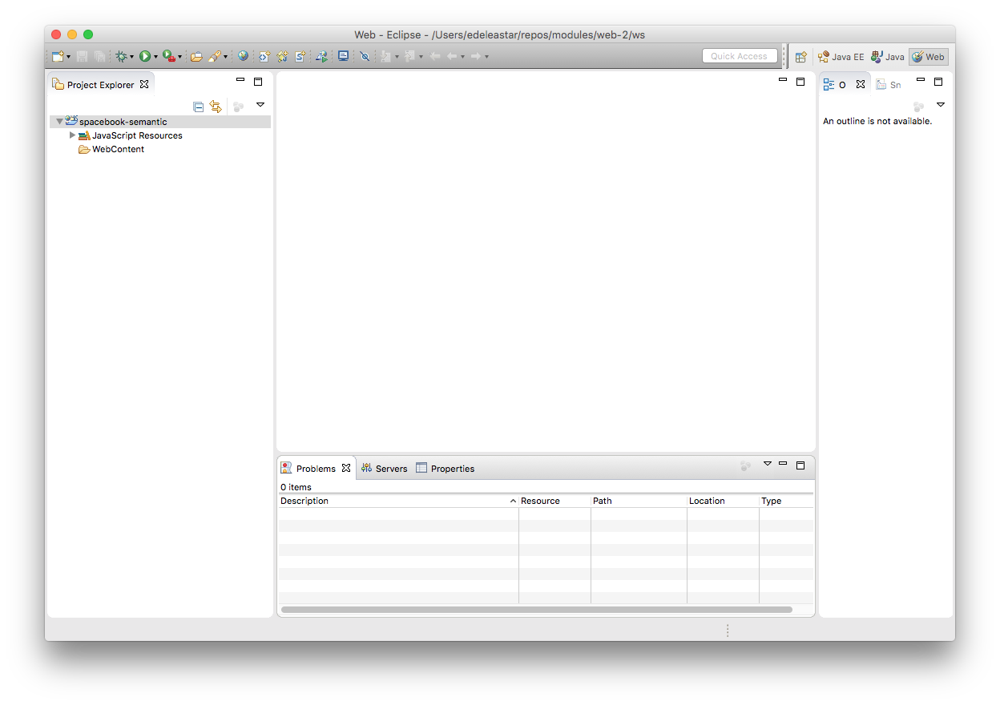

#Install Eclipse

To date we have been using Sublime Text as our primary editor. While we can continue to use it, we will supplement our tool set with a professional Java Integrated Development Environment (IDE) called Eclipse:

- <http://www.eclipse.org/downloads/>

Select the first one here: `Eclipse IDE for Java EE Developers`

If you are using the Labs in Walton: Eclipse can be found in `C:/dev/eclipse`.

Make sure you can launch eclipse now. It may look like this initially:

If you close the welcome screen (click x on the top left) - you will see the main project workspace:

This is empty for the moment.

We can use Eclipse as an alternative to the Sublime editor for creating and editing Web projects.

Select `File->New->Static Web Project`:

Call the project 'spacebook-semantic'

.. accept the suggested change of perspective:

Your new project should look like this:

