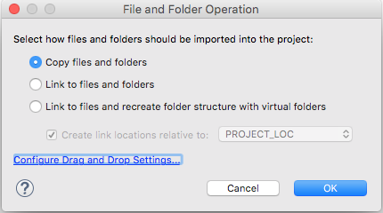
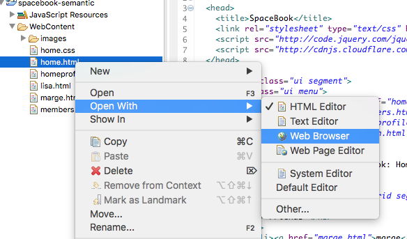
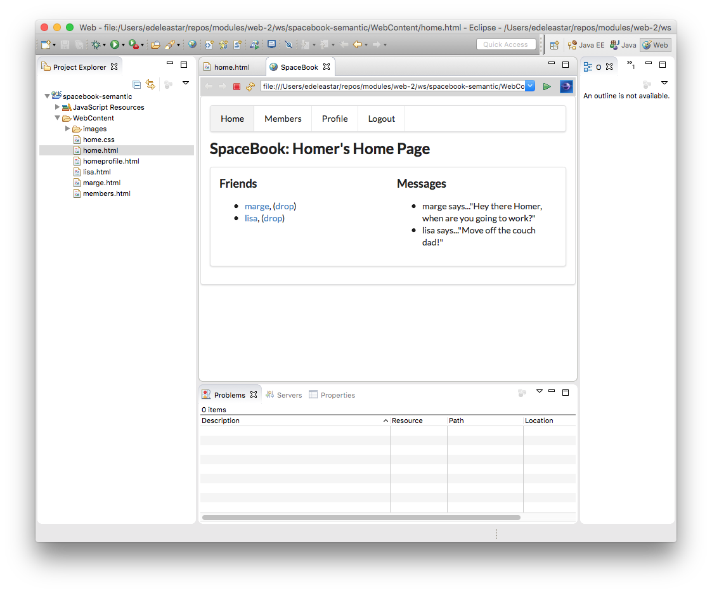

#Import spacebook-semantic Files

This is a static web site produced from Lab06a:

- [spacebook-semantic](archives/spacebook-semantic.zip)

Download and unzip this somewhere convenient on our workstation.

Using Windows Explorer (for Finder on the mac) see if you can drag all of the files from the archive and drop them onto the `WebContent` icon in the Eclipse project:

As you drop them, eclipse may ask you if want to 'copy' them - say yes to this:

The completed project should look like this:

Notice that, unlike Sublime Text, Eclipse has a built on Browser:

This is your first Eclipse project - a static web site.