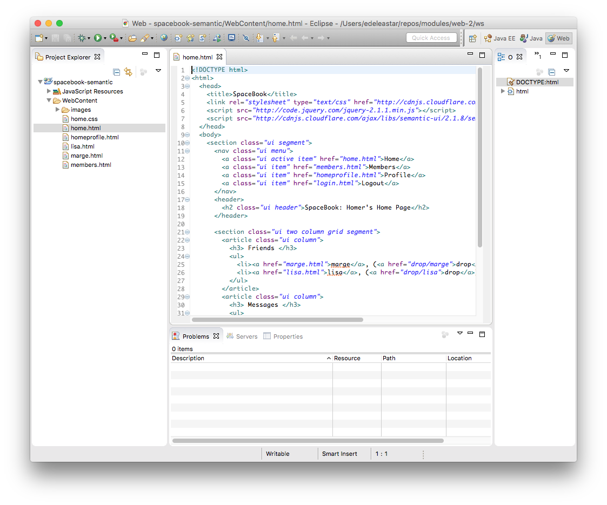
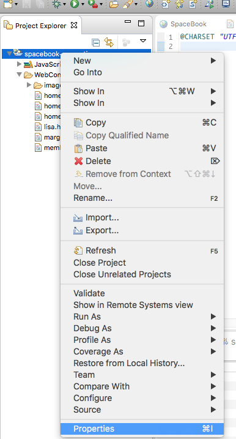
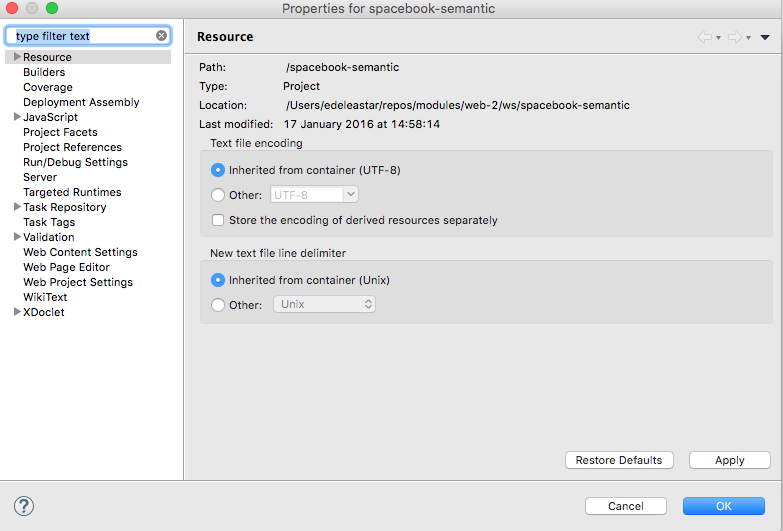
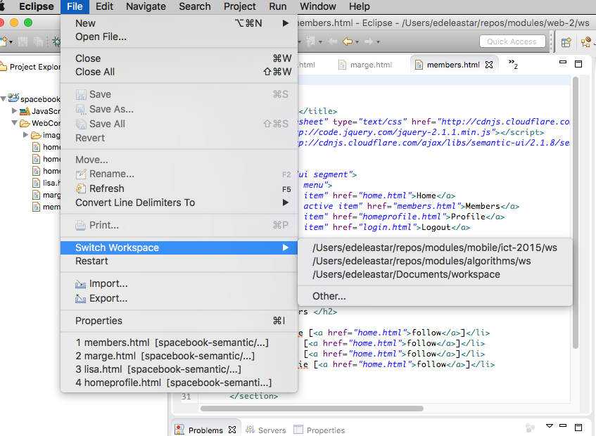
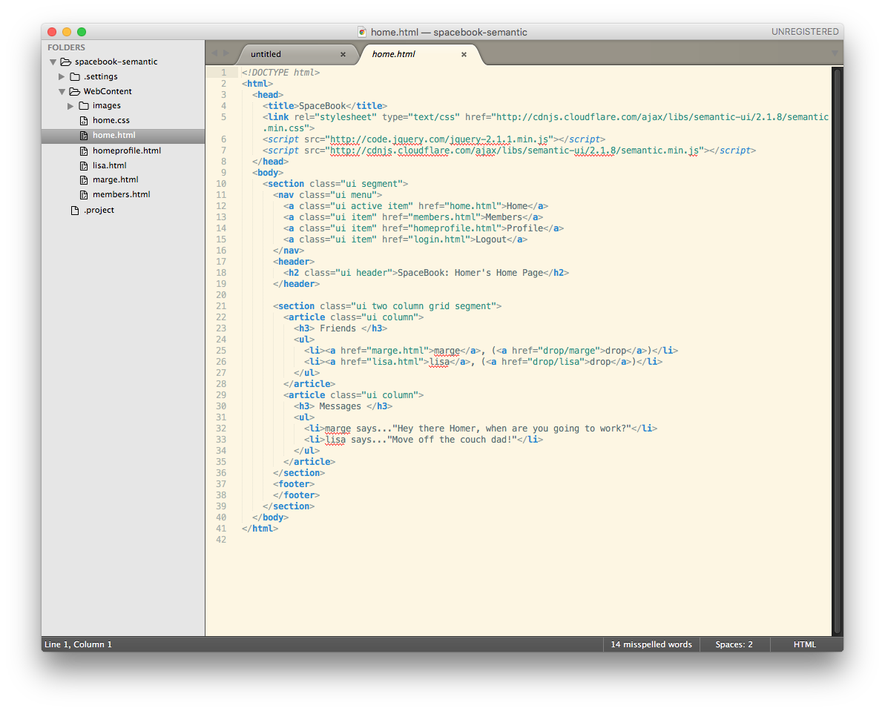

#Eclipse Workspace

Where is this project located on your hard disk?

The answer to this is 'it depends!'

Unlike Sublime, Eclipse maintains a 'Workspace' of all projects that adhere to the Eclipse Project Structure (Sublime has no project structure). This workspace is located somewhere on your computer - but it can be confusing to find at first.

To locate the workspace - right-click on the project in Eclipse and and select 'Properties' from the menu:

This shows the project panel:

The actual folder where your project is located is listed under `Location' in that panel.

Locate your actual project now in Explorer / Finder. 

You can change the workspace to a different folder at any stage:

Once you switch workspaces, then an projects you create will be based on this new location.

We can continue to use Sublime form time to time, although we will mostly focus in Eclipse from now on.

Open your project in sublime now as an experiment:

Notice there are some extra file/folders in the project - these are related to the Eclipse Project Structure - we dont need to worry about them for the moment.