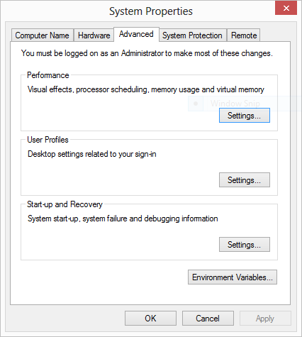

#Installing and Running Play

##Windows

Visit the following site:

- <http://www.playframework.org>

In particular, vist the download page:

- <https://www.playframework.com/download#older-versions>

On the this page, select and download play-1.4.1.zip (the version number is very important)

Unzip to somewhere on your PC - a good location might be:

~~~
C:\dev
~~~

Once you have unzipped it, the folder might look like this:

In the above, the play archive has been downloaded and expanded in `c:\dev`

See if you can put the folder is on your path. Detailed setup instructions are here for platforms other than Windows:

- <http://www.playframework.org/documentation/1.2.7/install>

Here is a shortened guide which may suffice:

##Mac/linux Users

Create or edit a file called .bash_profile in your home directory and set the path to include the extracted archive on the path. It might look like this:

~~~
PATH=$PATH:\
$HOME/dev/play-1.4.1
export PATH
~~~

This assumes you extracted the play archive into the dev folder.

##Windows
For Windows machine, you need to do the following:

---

Locate the "Computer" icon in explorer

Right click on this and select 'Properties':

Select 'Advanced System Settings':

Select 'Environment Variables':

Under "System Variables", locate and select the 'Path' entry:

Edit this entry, and append the path in which play is installed. This should be `C:\dev\play-1.4.1`

NB: DO NOT DELETE THE CURRENT VALUE OF THE PATH! You are trying to append on to the end of the string in there already.Note that a `;` separates this new entry from the last one.

Press "Ok" all the way back and rerun the command prompt (close the one already open)

To test, just type "play" from a command prompt you should see something like this:

~~~
~        _            _
~  _ __ | | __ _ _  _| |
~ | '_ \| |/ _' | || |_|
~ |  __/|_|\____|\__ (_)
~ |_|            |__/
~
~ play! 1.4.1, http://www.playframework.org
~
~ Usage: play cmd [app_path] [--options]
~
~ with,  new      Create a new application
~        run      Run the application in the current shell
~        help     Show play help
~~~

Or, if you did not manage to get the play folder on the path, then this command here should work (if you used the recommended folder structure)

~~~
C:\dev\play1-1.4.1\play
~~~

However, it is best to ensure that the play command is on the system path.

