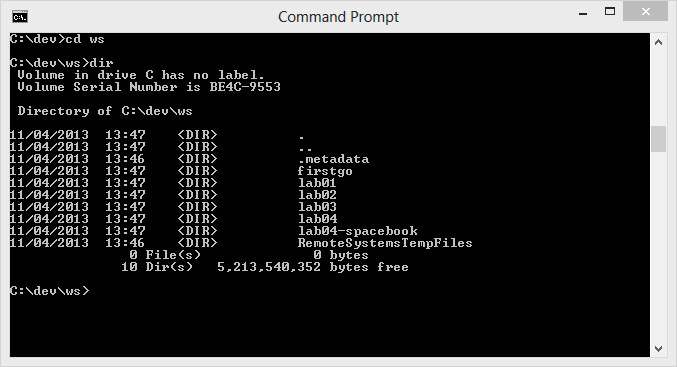
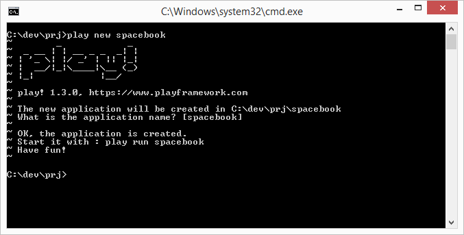
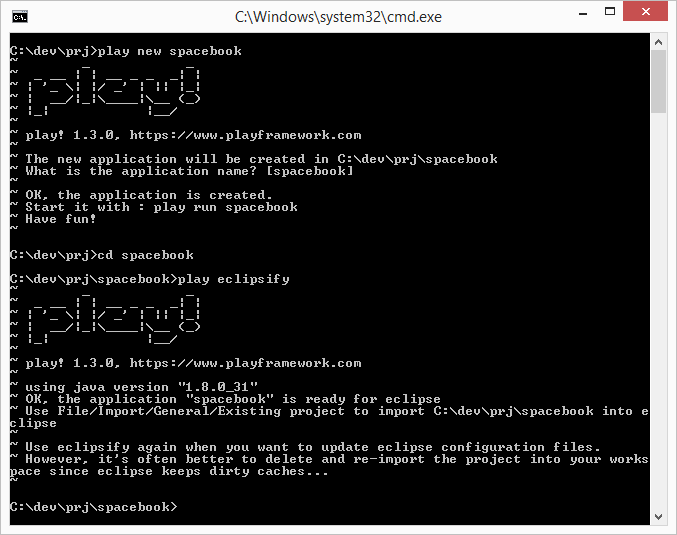
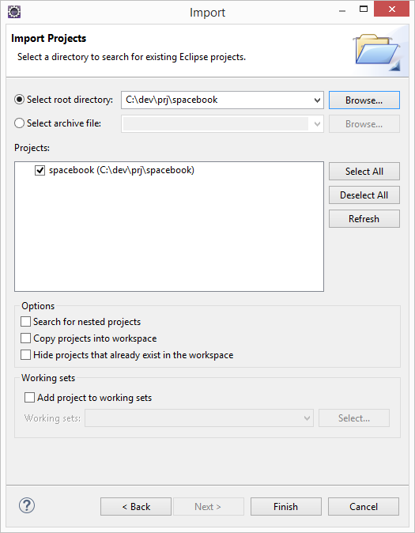
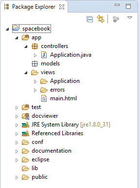

#Create a Play/Eclipse Project

##Dynamic version of Spacebook

Back in the command line, you will need to navigate to your web development workspace. This might lead you somewhere like this:

Now create a new project by typing the following:

~~~
play new spacebook
~~~

You should get:

~~~
~        _            _ 
~  _ __ | | __ _ _  _| |
~ | '_ \| |/ _' | || |_|
~ |  __/|_|\____|\__ (_)
~ |_|            |__/   
~
~ play! 1.4.1, http://www.playframework.org
~
~ The new application will be created in /Users/edeleastar/Dropbox/webdev/2012/dev/projects/spacebook
~ What is the application name? [spacebook] 
~~~

Press return when prompted for the name to accept the default (spacebook)

~~~
~
~ OK, the application is created.
~ Start it with : play run spacebook
~ Have fun!
~
~~~

In DOS it might look like this:

Explore the generated folder - called 'spacebook'. It should contain six folders
* app
* conf
* lib
* public
* test
We can import this project into eclipse. First, change into the spacebook folder

~~~
cd spacebook
~~~

Then run this command:

~~~
play eclipsify
~~~

The system will respond with:

~~~
~        _            _ 
~  _ __ | | __ _ _  _| |
~ | '_ \| |/ _' | || |_|
~ |  __/|_|\____|\__ (_)
~ |_|            |__/   
~
~ play! 1.4.1, http://www.playframework.org
~
~ OK, the application is ready for eclipse
~ Use File/Import/General/Existing project to import /Users/edeleastar/Dropbox/webdev/2012/dev/projects/spacebook into eclipse
~
~ Use eclipsify again when you want to update eclipse configuration files.
~ However, it's often better to delete and re-import the project into your workspace since eclipse keeps dirty caches...
~
~~~

The above sequence might look like this in DOS:

Now, launch eclipse - in the usual way. In eclipse, select "File->Import->General->Existing Projects into Workspace" and navigate to the folder containing the spacebook application just generated.

Once imported into eclipse, the project should look like this:

The project may not look like this initially. If it doesnt, then switch to the "Java Perspective" in Eclipse, and it should resemble the above. To switch perspectives - in eclipse select "Window->Open Perspective->Java"
